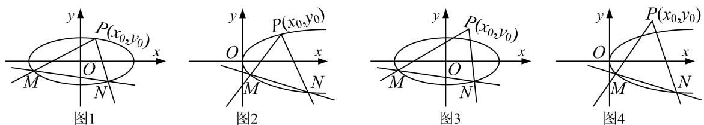

## 方法总结

单参数法：设出动点可动直线的方程为，解出点 M 的坐标为 $(A(k), B(k))$ ，解出点 N 的坐标为 $(C(k), D(k))$ ，然后写出动直线 MN 方程，即 $kf(x, y) + g(x, y) = 0$ ，根据直线过定点时与参数没有关系（即方程对参数的任意值都成立），得到方程组 $\left\{\begin{aligned}f(x, y)=0,\\ g(x, y)=0;\end{aligned}\right.$ 以方程组的解为坐标的点就是直线所过的定点.

