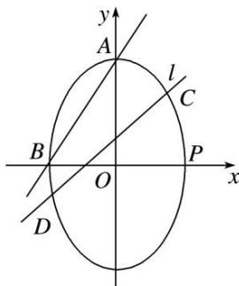

> [!faq]- 《专题16 已知核心方程(隐性)和未知核心方程直线过定点模型(教师版)》例题解析
>
> > [!success]- **【答案】** 详见解析
>
> > [!note]- **【解析】**
> > (1)求椭圆 M 的方程;
> >
> > (2)证明：直线 $l$ 与 $x$ 轴交于定点，并求出定点的坐标.
> >
> > 
> >
> > 2. 解析
> > (1)由已知, 得 $a^2 + b^2 = 5^2$ , 由点 $A(0, a)$ , $B(-b, 0)$ 知,
> >
> > 直线 AB 的方程为 $\frac{x}{-b} + \frac{y}{a} = 1$ ，即 ax - by + ab = 0。
> >
> > 又原点 $O$ 到直线 $AB$ 的距离为 $\frac{12}{5}$ ，即 $\frac{|0 - 0 + ab|}{\sqrt{a^2 + b^2}} = \frac{12}{5}$ ，所以 $a^2 = 16, b^2 = 9, c^2 = 16 - 9 = 7$ .
> >
> > 故椭圆 M 的方程为 $\frac{y^{2}}{16} + \frac{x^{2}}{9} = 1$ .
> >
> > (2)双参数法
> >
> > 由
> > (1)知 $P(3, 0)$ ，设 $C(x_{1}, y_{1})$ ， $D(x_{2}, y_{2})$ ，将 $x = my + n$ 代入 $\frac{y^{2}}{16} + \frac{x^{2}}{9} = 1$ ，
> >
> > 整理，得 $(16m^{2}+9)y^{2}+32mny+16n^{2}-144=0$ ，则 $y_{1}+y_{2}=-\frac{32mn}{16m^{2}+9}$ ， $y_{1}y_{2}=\frac{16n^{2}-144}{16m^{2}+9}$ .
> >
> > 因为以 CD 为直径的圆过椭圆的右顶点 P，所以 $\overrightarrow{PC} \cdot \overrightarrow{PD} = 0$ ，即 $(x_{1} - 3, y_{1}) \cdot (x_{2} - 3, y_{2}) = 0$ ，
> >
> > 所以 $(x_{1}-3)(x_{2}-3)+y_{1}y_{2}=0$ ，又 $x_{1}=my_{1}+n,\quad x_{2}=my_{2}+n,$
> >
> > 所以 $(my_{1}+n-3)(my_{2}+n-3)+y_{1}y_{2}=0$ ，整理，得 $(m^{2}+1)y_{1}y_{2}+m(n-3)(y_{1}+y_{2})+(n-3)^{2}=0$ ，
> >
> > $$
> > (m ^ {2} + 1) \cdot \frac {1 6 n ^ {2} - 1 4 4}{1 6 m ^ {2} + 9} + m (n - 3) \cdot \frac {- 3 2 m n}{1 6 m ^ {2} + 9} + (n - 3) ^ {2} = 0
> > $$
> >
> > 所以 $\frac{16(m^2 + 1)(n^2 - 9)}{16m^2 + 9} - \frac{32m^2n(n - 3)}{16m^2 + 9} + (n - 3)^2 = 0,$
> >
> > 易知 $n \neq 3$ ，所以 $16(m^{2} + 1)(n + 3) - 32m^{2}n + (16m^{2} + 9) \cdot (n - 3) = 0$ ，
> >
> > 整理，得 $25n + 21 = 0$ ，即 $n = -\frac{21}{25}$ ，经检验， $n = -\frac{21}{25}$ 符合题意.
> >
> > 所以直线 l 与 x 轴交于定点，定点的坐标为 $\left(-\frac{21}{25}, 0\right)$ .
