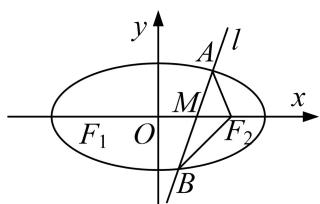

<!-- question-source:start -->
[例4] 已知 $F_{1}, F_{2}$ 为椭圆 $C: \frac{x^{2}}{2} + y^{2} = 1$ 的左、右焦点，过椭圆长轴上一点 $M(m, 0)$ (不含端点)作一条直线 $l$ ，交椭圆于 $A, B$ 两点.

(1)若直线 $AF_{2}$ ，AB， $BF_{2}$ 的斜率依次成等差数列(公差不为 0)，求实数 m 的取值范围；

(2)若过点 $P\left(0, -\frac{1}{3}\right)$ 的直线交椭圆 $C$ 于 $E, F$ 两点，则以 $EF$ 为直径的圆是否恒过定点？若是，求出该定点的坐标；若不是，请说明理由.

<!-- question-source:end -->

![[高中/总复习/专题/圆锥曲线/专题17 圆过定点模型-圆锥曲线/专题17_圆过定点模型/例题/answers/Q00042459A1.md]]
