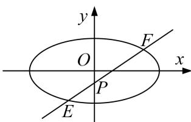

> [!faq]- 《专题17 圆过定点模型-圆锥曲线》例题解析
>
> > [!success]- **【答案】** 详见解析
>
> > [!note]- **【解析】**
> > (1) 图
> >
> >   
> > (2) 图
> >
> > [规范解答]
> > (1)由题意知 $F_{1}(-1,0)$ ， $F_{2}(1,0)$ ，直线 $l$ 的斜率存在且不为 0，
> >
> > 设直线 l 的方程为 $y=k(x-m)(k\neq0)$ ， $A(x_{1},y_{1})$ ， $B(x_{2},y_{2})$ ，
> >
> > 则 $y_{1}=k(x_{1}-m)$ ， $y_{2}=k(x_{2}-m)$ ，因为 $\frac{y_{1}}{x_{1}-1}+\frac{y_{2}}{x_{2}-1}=2k$ ，即 $\frac{k(x_{1}-m)}{x_{1}-1}+\frac{k(x_{2}-m)}{x_{2}-1}=2k$ ，
> >
> > 整理得 $(x_{1}+x_{2})(1-m)=2(1-m)$ ，又公差不为0，所以 $x_{1}+x_{2}=2$ ，
> >
> > 由 $\left\{\begin{aligned}y&=k(x-m),\\ \frac{x^{2}}{2}&+y^{2}=1,\end{aligned}\right.$ 得 $(1+2k^{2})x^{2}-4k^{2}mx+2k^{2}m^{2}-2=0,$
> >
> > 由 $x_{1}+x_{2}=\frac{4k^{2}m}{1+2k^{2}}=2$ ，得 $k^{2}=\frac{1}{2(m-1)}>0$ ，所以 m>1。
> >
> > 又点 $M(m, 0)$ 在椭圆长轴上(不含端点)，
> >
> > 所以 $1<m<\sqrt{2}$ ，即实数 m 的取值范围为 $(1, \sqrt{2})$ .
> >
> > (2)赋值法
> >
> > 假设以 EF 为直径的圆恒过定点.
> >
> > 当 $EF \perp x$ 轴时，以 EF 为直径的圆的方程为 $x^{2} + y^{2} = 1$ ;
> >
> > 当 $EF \perp y$ 轴时，以 EF 为直径的圆的方程为 $x^{2} + \left(y + \frac{1}{3}\right)^{2} = \frac{16}{9}$ ,
> >
> > 则两圆的交点为 $Q(0, 1)$ .
> >
> > 下证当直线 EF 的斜率存在且不为 0 时，点 $Q(0, 1)$ 在以 EF 为直径的圆上.
> >
> > 设直线 EF 的方程为 $y=k_{0}x-\frac{1}{3}(k_{0}\neq0)$ ,
> >
> > 代入 $\frac{x^{2}}{2}+y^{2}=1$ ，整理得 $(2k_{0}^{2}+1)x^{2}-\frac{4}{3}k_{0}x-\frac{16}{9}=0$ ，
> >
> > 设 $E(x_{3},y_{3})$ ， $F(x_4,y_4)$ ，则 $x_{3} + x_{4} = \frac{4k_{0}}{3(2k_{0}^{2} + 1)}$ ， $x_{3}x_{4} = \frac{-16}{9(2k_{0}^{2} + 1)}$
> >
> > 又 $\overrightarrow{QE} = (x_3, y_3 - 1)$ , $\overrightarrow{QF} = (x_4, y_4 - 1)$ ,
> >
> > 所以 $\overrightarrow{QE}\cdot\overrightarrow{QF}=x_{3}x_{4}+(y_{3}-1)(y_{4}-1)=x_{3}x_{4}+\left(k_{0}x_{3}-\frac{4}{3}\right)\left(k_{0}x_{4}-\frac{4}{3}\right)$
> >
> > $$
> > = (1 + k _ {0} ^ {2}) x _ {3} x _ {4} - \frac {4}{3} k _ {0} \left(x _ {3} + x _ {4}\right) + \frac {1 6}{9} = (1 + k _ {0} ^ {2}) \cdot \frac {- 1 6}{9 \left(2 k _ {0} ^ {2} + 1\right)} - \frac {4}{3} k _ {0} \cdot \frac {4 k _ {0}}{3 \left(2 k _ {0} ^ {2} + 1\right)} + \frac {1 6}{9} = 0,
> > $$
> >
> > 所以点 $Q(0,1)$ 在以 EF 为直径的圆上．综上，以 EF 为直径的圆恒过定点 $(0,1)$ .
> >
> > [例 5] 等边三角形 OAB 的边长为 $8\sqrt{3}$ ，且其三个顶点均在抛物线 E: $x^{2}=2py(p>0)$ 上.
