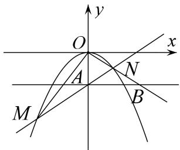

<!-- question-source:start -->
[例 1] (2019·北京)已知抛物线 C: $x^{2}=-2py$ 经过点(2, -1).

(1)求抛物线 C 的方程及其准线方程;

(2)设 O 为原点，过抛物线 C 的焦点作斜率不为 0 的直线 l 交抛物线 C 于两点 M, N，直线 y = -1 分别交直线 OM, ON 于点 A 和点 B．求证：以 AB 为直径的圆经过 y 轴上的两个定点.

(2)向量法

抛物线 C 的焦点为 $F(0, -1)$ ，设直线 l 的方程为 $y = kx - 1 (k \neq 0)$ .

由 $\left\{\begin{aligned}y&=kx-1,\\ x^{2}&=-4y\end{aligned}\right.$ 得 $x^{2}+4kx-4=0.$

设 $M(x_{1},y_{1}),N(x_{2},y_{2})$ ，则 $x_{1}x_{2} = -4$

直线 $OM$ 的方程为 $y = \frac{y_1}{x_1} x$ 。令 $y = -1$ ，得点 $A$ 的横坐标 $x_A = -\frac{x_1}{y_1}$ 。

同理得点 B 的横坐标 $x_{B}=-\frac{x_{2}}{y_{2}}$ . 设点 $D(0, n)$ ,

$$
| \overrightarrow {D A} = \left[ - \frac {x _ {1}}{y _ {1}}, - 1 - n \right], \overrightarrow {D B} = \left[ - \frac {x _ {2}}{y _ {2}}, - 1 - n \right],
$$

$$
\overrightarrow {D A} \cdot \overrightarrow {D B} = \frac {x _ {1} x _ {2}}{y _ {1} y _ {2}} + (n + 1) ^ {2} = \overline {{\left[ - \frac {x _ {1} ^ {2}}{4} \right] \left[ - \frac {x _ {2} ^ {2}}{4} \right]}} + (n + 1) ^ {2} = \frac {1 6}{x _ {1} x _ {2}} + (n + 1) ^ {2} = - 4 + (n + 1) ^ {2}.
$$

令 $\overrightarrow{DA}\cdot\overrightarrow{DB}=0$ ，即 $-4+(n+1)^{2}=0$ ，则n=1或n=-3。

综上，以 AB 为直径的圆经过 y 轴上的定点 $(0, 1)$ 和 $(0, -3)$ .
<!-- question-source:end -->

![[高中/总复习/专题/圆锥曲线/专题17 圆过定点模型-圆锥曲线/专题17_圆过定点模型/例题选讲/例题/answers/Q00032303A1.md]]
