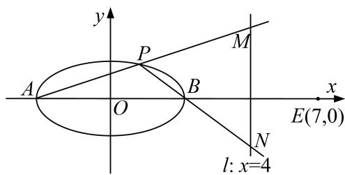

<!-- question-source:start -->
[例 2] 已知椭圆 $\frac{x^{2}}{a^{2}}+\frac{y^{2}}{b^{2}}=1(a>b>0)$ 过点 $Q(1,\frac{3}{2})$ ，且离心率 $e=\frac{1}{2}$ .

(1)求椭圆 C 的方程;

(2)椭圆 C 长轴两端点分别为 A, B, 点 P 为椭圆上异于 A, B 的动点，直线 l: x=4 与直线 PA, PB 分别交于 M, N 两点，又点 E(7, 0)，过 E, M, N 三点的圆是否过 x 轴上不同于点 E 的定点？若经过，求出定点坐标；若不存在，请说明理由.

(2)向量法

设点 $P(x_{0}, y_{0})$ ，直线 PA，PB 的斜率分别为 $k_{1}$ ， $k_{2}$ ，由椭圆的第三定义知 $k_{1}k_{2}=e^{2}-1=-\frac{3}{4}$

又 PA: $y=k_{1}(x+2)$ ，令 x=4，得 $M(4, 6k_{1})$ ,

同理：PB: $y=k_{2}(x-2)$ ，令 x=4，得 $N(4, 2k_{2})$ ,

则 $k_{EM}k_{EN} = (-\frac{6k_1}{3})(-\frac{2k_2}{3}) = -1$ ，过 $E$ ， $M$ ， $N$ 三点的圆的直径为 $MN$

设圆过定点 $R(m, 0)$ ，则 $\overrightarrow{RM} \cdot \overrightarrow{RN} = 0$ ，因为 $\overrightarrow{RM} = (4 - m, 6k_{1})$ ， $\overrightarrow{RN} = (4 - m, 2k_{2})$ .

所以 $\overrightarrow{RM}\cdot\overrightarrow{RN}=(4-m)^{2}+12k_{1}k_{2}=0$ ，即 $(4-m)^{2}=9$ ，解得m=1或m=7(舍).

故经过 E, M, N 三点的圆是以 MN 为直径，过 x 轴上不同于点 E 的定点 $R(1, 0)$ .
<!-- question-source:end -->

![[高中/总复习/专题/圆锥曲线/专题17 圆过定点模型-圆锥曲线/专题17_圆过定点模型/例题选讲/例题/answers/Q00032304A1.md]]
