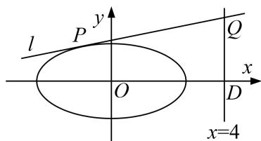

<!-- question-source:start -->
[例3] 已知 $A(-2, 0)$ , $B(2, 0)$ , 点 $C$ 是动点且直线 $AC$ 和直线 $BC$ 的斜率之积为 $-\frac{3}{4}$ .

(1)求动点 C 的轨迹方程;

(2)设直线 $l$ 与(1)中轨迹相切于点 $P$ , 与直线 $x = 4$ 相交于点 $Q$ , 判断以 $PQ$ 为直径的圆是否过 $x$ 轴上一定点.

(2)方法一：向量法

易知直线 l 的斜率存在，设直线 l: $y=kx+m$ .

联立方程组 $\left\{\begin{aligned}y=kx+m,\\ \frac{x^{2}}{4}+\frac{y^{2}}{3}=1,\end{aligned}\right.$ 消去 y 并整理，得 $(3+4k^{2})x^{2}+8kmx+4m^{2}-12=0.$

依题意得 $\Delta=(8km)^{2}-4(3+4k^{2})(4m^{2}-12)=0$ ，即 $3+4k^{2}=m^{2}$ .

设 $x_{1}, x_{2}$ 为方程 $(3 + 4k^{2})x^{2} + 8kmx + 4m^{2} - 12 = 0$ 的两个根，则 $x_{1} + x_{2} = \frac{-8km}{3 + 4k^{2}}$ ，所以 $x_{1} = x_{2} = \frac{-4km}{3 + 4k^{2}}$ . 所以 $P\left(\frac{-4km}{3 + 4k^{2}}, \frac{3m}{3 + 4k^{2}}\right)$ ，即 $P\left(\frac{-4k}{m}, \frac{3}{m}\right)$ .

又 $Q(4, 4k+m)$ ，设 $R(t, 0)$ 为以 PQ 为直径的圆上一点，则由 $\overrightarrow{RP} \cdot \overrightarrow{RQ} = 0$ ，

得 $\left(-\frac{4k}{m}-t,\frac{3}{m}\right)\cdot(4-t,4k+m)=0$ ，整理，得 $\frac{4k}{m}(t-1)+t^{2}-4t+3=0$ .

由 $\frac{k}{m}$ 的任意性，得 t-1=0 且 $t^{2}-4t+3=0$ ，解得 t=1。

综上可知以 PQ 为直径的圆过 x 轴上一定点 $(1, 0)$ .

方法二：向量法

设 $P(x_{0}, y_{0})$ ，则曲线 C 在点 P 处的切线 PQ: $\frac{x_{0}x}{4} + \frac{y_{0}y}{3} = 1$ ，令 x = 4，得 $Q\left(4, \frac{3 - 3x_{0}}{y_{0}}\right)$ .

设 $R(t, 0)$ 为以 PQ 为直径的圆上一点，则由 $\overrightarrow{RP} \cdot \overrightarrow{RQ} = 0$ ，

得 $(x_{0}-t)\cdot(4-t)+3-3x_{0}=0$ ，即 $x_{0}(1-t)+t^{2}-4t+3=0$ .

由 $x_{0}$ 的任意性，得 1-t=0 且 $t^{2}-4t+3=0$ ，解得 t=1。

综上可知，以 PQ 为直径的圆过 x 轴上一定点 $(1, 0)$ .
<!-- question-source:end -->

![[高中/总复习/专题/圆锥曲线/专题17 圆过定点模型-圆锥曲线/专题17_圆过定点模型/例题选讲/例题/answers/Q00032305A1.md]]
