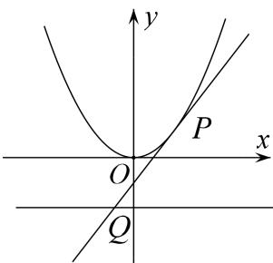

<!-- question-source:start -->
[例 5] 等边三角形 OAB 的边长为 $8\sqrt{3}$ ，且其三个顶点均在抛物线 E: $x^{2}=2py(p>0)$ 上.

(1)求抛物线 E 的方程;

(2)设动直线 $l$ 与抛物线 $E$ 相切于点 $P$ , 与直线 $y = -1$ 相交于点 $Q$ . 证明: 以 $PQ$ 为直径的圆恒过某定点.

(2)解法 1: 向量法

由(1)知 $y=\frac{1}{4}x^{2}$ ，所以 $y'=\frac{1}{2}x$ 。设点 $P(x_{0}, y_{0})$ ， $Q(x_{1}, -1)$ ，则 $x_{0}\neq0$ ，

l 的方程为 $y-y_{0}=\frac{1}{2}x_{0}(x-x_{0})$ ，即 $y=\frac{1}{2}x_{0}x-\frac{1}{4}x_{0}^{2}$ 。令 y=-1，可得 $x_{1}=\frac{x_{0}^{2}-4}{2x_{0}^{2}}$ 。

设 $M(m, n)$ 是圆上一点，则 $\overrightarrow{MP} \cdot \overrightarrow{MQ} = 0$ ，即 $(m - x_{0})(m - \frac{x_{0}^{2} - 4}{2x_{0}}) + (n - y_{0})(n + 1) = 0$ ，整理可得 $m^{2} - \frac{3x_{0}^{2} - 4}{2x_{0}}m + \frac{x_{0}^{2}}{2} - 2 + n^{2} + n - n y_{0} - y_{0} = 0$ ，

因为 $y_{0}=\frac{1}{4}x_{0}^{2}$ ，所以 $-m\frac{3x_{0}^{2}-4}{2x_{0}}+(1-n)\frac{x_{0}^{2}}{4}+(n^{2}+n+m^{2}-2)=0$ ，

该式子要对任意的满足 $y_0 = \frac{1}{4} x_0^2 (x_0 \neq 0)$ 的 $x_0$ 恒成立，

所以 $\left\{ \begin{array}{l} m = 0, \\ 1 - n = 0 \\ n^2 + n + m^2 - 2 = 0 \end{array} \right.$ ，由此解得 $\left\{ \begin{array}{l} m = 0, \\ n = 1 \end{array} \right.$ ，所以以 $PQ$ 为直径的圆恒过定点(0，1).

解法 2: 向量法

由对称性可知该定点必在 y 轴上，设为 $M(0, n)$ .

由(1)知 $y=\frac{1}{4}x^{2}$ ，所以 $y'=\frac{1}{2}x$ 。设点 $P(x_{0},y_{0})$ ， $Q(x_{1},-1)$ ，则 $x_{0}\neq0$ ，

$l$ 的方程为 $y - y_0 = \frac{1}{2} x_0(x - x_0)$ ，即 $y = \frac{1}{2} x_0x - \frac{1}{4} x_0^2$ 令 $y = -1$ ，可得 $x_{1} = \frac{x_{0}^{2} - 4}{2x_{0}^{2}}.$

由 $\overrightarrow{MP}\cdot\overrightarrow{MQ}=0$ ，可得 $\frac{x_{0}^{2}-4}{2}+(n-y_{0})(n+1)=0$ ，整理可得 $\frac{x_{0}^{2}}{2}-2+n^{2}+n-n y_{0}-y_{0}=0$ ，

因为 $y_{0}=\frac{1}{4}x_{0}^{2}$ ，所以 $(1-n)y_{0}+(n^{2}+n-2)=0$ ，该式子要对任意的满足 $y_{0}=\frac{1}{4}x_{0}^{2}(x_{0}\neq0)$ 的 $y_{0}$ 恒成立，
所以 $\left\{\begin{aligned}1-n=0,\\ n^{2}+n-2=0\end{aligned}\right.$ ，由此解得 n=1，所以以 PQ 为直径的圆恒过定点 $(0,1)$ .

解法 3: 赋值法

由对称性可知该定点必在 $y$ 轴上．由(1)知 $y = \frac{1}{4} x^2$ ，所以 $y' = \frac{1}{2} x$

设点 $P(x_{0}, y_{0})$ ， $Q(x_{1}, -1)$ ，则 $x_{0} \neq 0$ ，且 l 的方程为 $y - y_{0} = \frac{1}{2} x_{0}(x - x_{0})$ ，

即 $y = \frac{1}{2} x_0x - \frac{1}{4} x_0^2$ . 令 $y = -1$ ，可得 $x_{1} = \frac{x_{0}^{2} - 4}{2x_{0}^{2}}$ .

取 $x_{0}=2$ ，此时 $P(2,1)$ ， $Q(0,-1)$ ，

以 PQ 为直径的圆为 $x(x-2)+(y-1)(y+1)=0$ ，与 y 轴交于点 $M_{1}(0,1)$ 和 $M_{2}(0,-1)$ ;

取 $x_0 = 1$ ，此时 $P(1, \frac{1}{4})$ ， $Q(-\frac{3}{2}, -1)$

以 PQ 为直径的圆为 $(x-1)(x+\frac{3}{2})+(y-\frac{1}{4})(y+1)=0$ ，与 y 轴交于点 $M_{3}(0,1)$ 和 $M_{4}(0,-\frac{7}{4})$ .

由此可知，该定点为 $M(0, 1)$ ，下证 $M(0, 1)$ 就是所求的点.

因为 $\overrightarrow{MP}=(x_{0},y_{0}-1)$ ， $\overrightarrow{MQ}=(\frac{x_{0}^{2}-4}{2x_{0}^{2}},-2)$ ，所以 $\overrightarrow{MP}\cdot\overrightarrow{MQ}=\frac{x_{0}^{2}-4}{2}-2y_{0}+2$

所以以 PQ 为直径的圆恒过定点 $(0, 1)$ .
<!-- question-source:end -->

![[高中/总复习/专题/圆锥曲线/专题17 圆过定点模型-圆锥曲线/专题17_圆过定点模型/例题选讲/例题/answers/Q00032307A1.md]]
