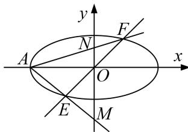

<!-- question-source:start -->
[例 6] 设 $F_{1}$ ， $F_{2}$ 分别为椭圆 C: $\frac{x^{2}}{a^{2}} + \frac{y^{2}}{b^{2}} = 1 (a > b > 0)$ 的左、右焦点，若椭圆上的点 $T(2, \sqrt{2})$ 到点 $F_{1}$ ，

$F_{2}$ 的距离之和等于 $4\sqrt{2}$ .

(1)求椭圆 C 的方程;

(2)若直线 $y=kx(k\neq0)$ 与椭圆 C 交于 E, F 两点，A 为椭圆 C 的左顶点，直线 AE, AF 分别与 y 轴交于点 M, N. 问：以 MN 为直径的圆是否经过定点？若经过，求出定点的坐标；若不经过，请说明理由.

(2)方程法

因为椭圆 C 的左顶点为 A，所以点 A 的坐标为 $(-2\sqrt{2}, 0)$ .

因为直线 $y=kx(k\neq0)$ 与椭圆 $\frac{x^{2}}{8}+\frac{y^{2}}{4}=1$ 交于 E, F 两点，设点 $E(x_{0}, y_{0})$ (不妨设 $x_{0}>0$ ),

则点 $F(-x_0, -y_0)$ . 由 $\left\{ \begin{array}{l} y = kx, \\ \frac{x^2}{8} + \frac{y^2}{4} = 1 \end{array} \right.$ 消去 $y$ ，得 $x^2 = \frac{8}{1 + 2k^2}$ ,

所以 $x_0 = \frac{2\sqrt{2}}{\sqrt{1 + 2k^2}}$ ，则 $y_{0} = \frac{2\sqrt{2}k}{\sqrt{1 + 2k^{2}}}$ ，所以直线 $AE$ 的方程为 $y = \frac{k}{1 + \sqrt{1 + 2k^2}} (x + 2\sqrt{2})$

因为直线 AE，AF 分别与 y 轴交于点 M，N，令 x=0，得 $y=\frac{2\sqrt{2}k}{1+\sqrt{1+2k^{2}}}$

即点 $M\left\{0, \frac{2\sqrt{2}k}{1+\sqrt{1+2k^{2}}}\right\}$ ，同理可得点 $N\left\{0, \frac{2\sqrt{2}k}{1-\sqrt{1+2k^{2}}}\right\}$ .

所以 $|MN|=\left|\frac{2\sqrt{2}k}{1+\sqrt{1+2k^{2}}}-\frac{2\sqrt{2}k}{1-\sqrt{1+2k^{2}}}\right|=\frac{2\sqrt{2(1+2k^{2})}}{|k|}$ .

设 MN 的中点为 P，则点 P 的坐标为 $P\left(0, -\frac{\sqrt{2}}{k}\right)$ .

则以 MN 为直径的圆的方程为 $x^{2}+\left(y+\frac{\sqrt{2}}{k}\right)^{2}=\left(\frac{\sqrt{2(1+2k^{2})}}{|k|}\right)^{2}$ ，即 $x^{2}+y^{2}+\frac{2\sqrt{2}}{k}y=4$ .

令 y=0，得 $x^{2}=4$ ，即 x=2 或 x=-2。故以 MN 为直径的圆经过两定点 $P_{1}(2,0)$ ， $P_{2}(-2,0)$ 。
<!-- question-source:end -->

![[高中/总复习/专题/圆锥曲线/专题17 圆过定点模型-圆锥曲线/专题17_圆过定点模型/例题选讲/例题/answers/Q00032308A1.md]]
