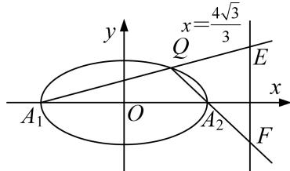

<!-- question-source:start -->
1. 已知椭圆 $\frac{x^2}{a^2} + \frac{y^2}{b^2} = 1 (a > b > 0)$ 的左、右焦点分别是 $F_1, F_2$ ，上、下顶点分别是 $B_1, B_2, C$ 是 $B_1F_2$ 的中点，若 $B_1\overrightarrow{F}_1 \cdot B_1\overrightarrow{F}_2 = 2$ 且 $\overrightarrow{CF_1} \perp B_1\overrightarrow{F}_2$ . $\frac{4\sqrt{3}}{3}$

(1)求椭圆的方程;

(2)点 $Q$ 是椭圆上任意一点， $A_{1}$ ， $A_{2}$ 分别是椭圆的左、右顶点，直线 $QA_{1}$ ， $QA_{2}$ 与直线 $x = \frac{4\sqrt{3}}{3}$ 分别交于 $E$ ， $F$ 两点，试证：以 $EF$ 为直径的圆与 $x$ 轴交于定点，并求该定点的坐标.

<!-- question-source:end -->

![[高中/总复习/专题/圆锥曲线/专题17 圆过定点模型-圆锥曲线/专题17_圆过定点模型/对点精练/题目/answers/Q00032309A1.md]]
