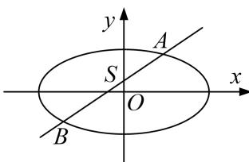

<!-- question-source:start -->
2. 已知圆 $C_1: (x + 1)^2 + y^2 = 8$ ，点 $C_2(1, 0)$ ，点 $Q$ 在圆 $C_1$ 上运动， $QC_2$ 的垂直平分线交 $QC_1$ 于点 $P$

(1)求动点 P 的轨迹 W 的方程;

(2)过 $S(0, \frac{1}{3})$ 且斜率为 $k$ 的动直线 $l$ 交曲线 $W$ 于 $A, B$ 两点，在 $y$ 轴上是否存在定点 $D$ ，使得以 $AB$ 为直径的圆恒过这个点？若存在，求出 $D$ 的坐标；若不存在，说明理由.

<!-- question-source:end -->

![[高中/总复习/专题/圆锥曲线/专题17 圆过定点模型-圆锥曲线/专题17_圆过定点模型/对点精练/题目/answers/Q00032310A1.md]]
