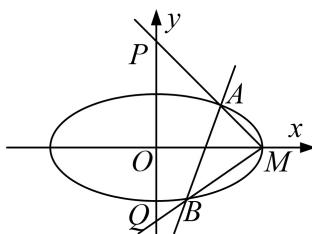

<!-- question-source:start -->
3. 已知椭圆 $C$ 的中心在坐标原点，左，右焦点分别为 $F_{1}, F_{2}, P$ 为椭圆 $C$ 上的动点， $\triangle PF_{1}F_{2}$ 的面积最大值为 $\sqrt{3}$ ，以原点为中心，椭圆短半轴长为半径的圆与直线 $3x - 4y + 5 = 0$ 相切.

(1)求椭圆的方程;

(2)若直线 l 过定点 $(1, 0)$ 且与椭圆 C 交于 A, B 两点，点 M 是椭圆 C 的右顶点，直线 AM, BM 分别与 y 轴交于 P, Q 两点，试问以线段 PQ 为直径的圆是否过 x 轴上的定点？若是，求出定点坐标；若不是，说明理由.

<!-- question-source:end -->

![[高中/总复习/专题/圆锥曲线/专题17 圆过定点模型-圆锥曲线/专题17_圆过定点模型/对点精练/题目/answers/Q00032311A1.md]]
