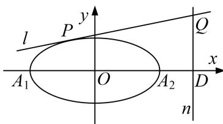

<!-- question-source:start -->
5. 已知椭圆 $C: \frac{x^2}{a^2} + \frac{y^2}{b^2} = 1 (a > b > 0)$ 的离心率是 $\frac{\sqrt{2}}{2}$ , $A_1, A_2$ 分别是椭圆 $C$ 的左、右两个顶点, 点 $F$ 是椭圆 $C$ 的右焦点. 点 $D$ 是 $x$ 轴上位于 $A_2$ 右侧的一点, 且满足 $\frac{1}{|A_1 D|} + \frac{1}{|A_2 D|} = \frac{1}{|F D|} = 2$ .

(1)求椭圆 C 的方程以及点 D 的坐标;

(2)过点 $D$ 作 $x$ 轴的垂线 $n$ , 再作直线 $l: y = kx + m$ , 与椭圆 $C$ 有且仅有一个公共点 $P$ , 直线 $l$ 交直线 $n$ 于点 $Q$ . 求证: 以线段 $PQ$ 为直径的圆恒过定点, 并求出定点的坐标.

<!-- question-source:end -->

![[高中/总复习/专题/圆锥曲线/专题17 圆过定点模型-圆锥曲线/专题17_圆过定点模型/对点精练/题目/answers/Q00032313A1.md]]
