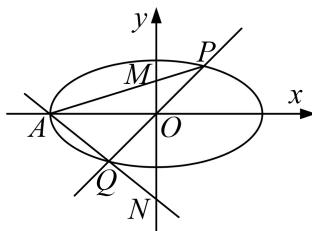

<!-- question-source:start -->
8. 如图，在平面直角坐标系 $xOy$ 中，离心率为 $\frac{\sqrt{2}}{2}$ 的椭圆 $C: \frac{x^2}{a^2} + \frac{y^2}{b^2} = 1 (a > b > 0)$ 的左顶点为 $A$ ，过原点

O 的直线(与坐标轴不重合)与椭圆 C 交于 P, O 两点，直线 PA, QA 分别与 y 轴交于 M, N 两点，当直线 PQ 的斜率为 $\frac{\sqrt{2}}{2}$ 时， $|PQ|=2\sqrt{3}$ .

(1)求椭圆 C 的标准方程;

(2)试问以 $MN$ 为直径的圆是否过定点(与 $PQ$ 的斜率无关)? 请证明你的结论.

<!-- question-source:end -->

![[高中/总复习/专题/圆锥曲线/专题17 圆过定点模型-圆锥曲线/专题17_圆过定点模型/对点精练/题目/answers/Q00032316A1.md]]
