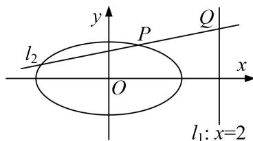

<!-- question-source:start -->
4. 已知椭圆 $C: \frac{x^2}{a^2} + \frac{y^2}{b^2} = 1 (a > b > 0)$ 的左、右焦点分别为 $F_1(-1, 0), F_21, 0)$ ，点 $P(x_0, y_0)(y_0 > 0)$ ，是椭圆 $C$ 上的动点，直线 $OP$ 的斜率等于 $\frac{\sqrt{2}}{2}$ 时， $PF_2 \perp x$ 轴.

(1)求椭圆 C 的方程;

(2)过点 P 且斜率为 $-\frac{x_{0}}{2y_{0}}$ 的直线 $l_{2}$ 与直线 $l_{1}$ : x=2 相较于点 Q，试判断以 PQ 为直径的圆是否过 x 轴上的定点？若是，求出定点坐标；若不是，说明理由.

<!-- question-source:end -->

![[高中/总复习/专题/圆锥曲线/专题17 圆过定点模型-圆锥曲线/专题17_圆过定点模型/对点训练/answers/Q00042466A1.md]]
