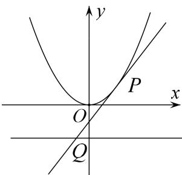

> [!faq]- 《专题17 圆过定点模型-圆锥曲线》例题解析
>
> > [!success]- **【答案】** 详见解析
>
> > [!note]- **【分析】**
> > 本题未单列分析。
>
> > [!note]- **【解析】**
> > (1)求动点 M 的轨迹 C 的方程;
> >
> > (2)已知 P 为曲线 C 上的一点，且曲线 C 在点 P 处的切线为 $l_{2}$ ，若直线 $l_{2}$ 与直线 $l_{1}$ 相交与点 Q．试探究在 y 轴上是否存在点 N，使得以 PQ 为直径的圆恒过点 N？若存在，求出点 N 的坐标；若不存在，说明理由.
> >
> > 6. 解析
> > (1) 设 $M(x, y)$ ，由题意得 $B(x, -1)$ ，又 $A(0, 1)$ ，
> >
> > $$
> > \therefore \overrightarrow {M A} = (- x, 1 - y), \overrightarrow {M B} = (0, - 1 - y), \overrightarrow {A B} = (x, - 2),
> > $$
> >
> > 由 $\overrightarrow{MA}\cdot\overrightarrow{AB}=\overrightarrow{MB}\cdot\overrightarrow{BA}$ ，得 $(\overrightarrow{MA}+\overrightarrow{MB})\overrightarrow{AB}=0$ ，
> >
> > 即 $(-x, -2y)(x, -2)=0$ ，化简得 $x^{2}=4y$ ，∴轨迹C的方程为 $x^{2}=4y$ .
> >
> > (2)向量法
> >
> > 设点 $N(0, n)$ ， $P(x_{0}, \frac{1}{4}x_{0}^{2})$ ，由 $y=\frac{1}{4}x^{2}$ ，所以 $y'=\frac{1}{2}x$ ，∴直线 $l_{2}$ 的斜率 $k_{l2}=\frac{1}{2}x_{0}$ ，
> >
> > 
> >
> > ∴ 直线 $l_{2}$ 的方程为 $y=\frac{1}{2}x_{0}x-\frac{1}{4}x_{0}^{2}$ . 令 y=-1，可得 $x_{1}=\frac{x_{0}^{2}-4}{2x_{0}}$ . ∴ 点 Q 的坐标为 $\left(\frac{x_{0}^{2}-4}{2x_{0}}, -1\right)$ .
> > 即由 $\overrightarrow{MP}\cdot\overrightarrow{NQ}=0$ ，可得 $\frac{x_{0}^{2}-4}{2}+(n-y_{0})(n+1)=0$ ，整理可得 $\frac{x_{0}^{2}}{2}-2+n^{2}+n-ny_{0}-y_{0}=0$
> >
> > 即 $(1-n)\frac{x_{0}^{2}}{4}+n^{2}+n-2=0$ ，要使此方程对 $x_{0}\in R$ 恒成立，则必有 $\left\{\begin{aligned}&1-n=0\\ &n^{2}+n-2=0\end{aligned}\right.$ ，解得n=1.
> > 即在 y 轴上存在点 N，使得以 PQ 为直径的圆恒过点 N，N 的坐标为 $(0,1)$ .
