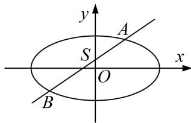

> [!faq]- 《专题17 圆过定点模型-圆锥曲线》例题解析
>
> > [!success]- **【答案】** 详见解析
>
> > [!note]- **【分析】**
> > 本题未单列分析。
>
> > [!note]- **【解析】**
> > (1)求椭圆的方程；
> >
> > (2)过点 $S(0, \frac{1}{3})$ 的动直线 $l$ 交椭圆 $C$ 于 $A$ 、 $B$ 两点，试问：在坐标平面上是否存在一个定点 $T$ ，使得以 $AB$ 为直径的圆恒过点 $T$ ？若存在，求出点 $T$ 的坐标；若不存在，请说明理由.
> >
> > 
> >
> > 7. 解析
> > (1)由 $\left\{ \begin{array}{l} y = x + b, \\ y^2 = 4x, \end{array} \right.$ 消去 $y$ 得， $x^2 + (2b - 4)x + b^2 = 0$ ，因直线 $y = x + b$ 与抛物线 $y^2 = 4x$ 相切， $\Delta = (2b - 4)^2 - 4b^2 = 0$ ， $\therefore b = 1$ ， $e = \frac{c}{a} = \frac{\sqrt{2}}{2}$ ， $a^2 = b^2 + c^2$ ， $\therefore \frac{a^2 - b^2}{a^2} = \frac{1}{2}$ ， $a^2 = 2$ ，故所求椭圆方程为 $\frac{x^2}{2} + y^2 = 1$ 。
> >
> > (2)赋值法
> >
> > 当 l 与 x 轴平行时，以 AB 为直径的圆的方程： $x^{2}+(y+\frac{1}{3})^{2}=(\frac{4}{3})^{2}$ .
> >
> > 当 l 与 x 轴垂直时，以 AB 为直径的圆的方程： $x^{2}+y^{2}=1$ ，
> >
> > 由 $\left\{\begin{aligned}x^{2}+(y+\frac{1}{3})^{2}&=(\frac{4}{3})^{2},\\ x^{2}+y^{2}&=1,\end{aligned}\right.$ 解得 $\left\{\begin{aligned}x&=0,\\ y&=1,\end{aligned}\right.$ 因此，所求的T如果存在，只能是 $T(0,1)$ .
> >
> > 证明：①当直线 L 与 x 轴垂直时，以 AB 为直径的圆过点 $T(0, 1)$ .
> > - **②**：当直线 L 与 x 轴不垂直时，设直线 L: $y=kx-\frac{1}{3}$ ,
> >
> > 由 $\left\{\begin{aligned}y&=kx-\frac{1}{3},\\ \frac{x^{2}}{2}&+y^{2}=1,\end{aligned}\right.$ 消去 y 得， $(9+18k^{2})x^{2}-12kx-16=0,$
> >
> > 设点 $A(x_{1},y_{1})$ ， $B(x_{2},y_{2})$ ，则 $x_{1} + x_{2} = \frac{12k}{9 + 18k^{2}}$ ， $x_{1}x_{2} = \frac{-16}{9 + 18k^{2}}$
> >
> > 又∵ $\overrightarrow{TA}=(x_{1},y_{1}-1)$ ， $\overrightarrow{TB}=(x_{2},y_{2}-1)$ .
> >
> > $$
> > \overrightarrow {T A} \cdot \overrightarrow {T B} = x _ {1} x _ {2} + (y _ {1} - 1) (y _ {2} - 1) = x _ {1} x _ {2} + (k x _ {1} - \frac {4}{3}) (k x _ {2} - \frac {4}{3})
> > $$
> >
> > $$
> > = (k ^ {2} + 1) x _ {1} x _ {2} - \frac {4}{3} k (x _ {1} + x _ {2}) + \frac {6}{1 9} = (k ^ {2} + 1) \frac {- 1 6}{9 + 1 8 k ^ {2}} - \frac {4}{3} k \frac {1 2 k}{9 + 1 8 k ^ {2}} + \frac {6}{1 9} = 0.
> > $$
> >
> > 所以 $\overrightarrow{TA}\perp\overrightarrow{TB}$ ，即以AB为直径的圆恒过 $T(0,1)$ .
> >
> > 综上所述，存在点 $T(0, 1)$ 满足条件.
