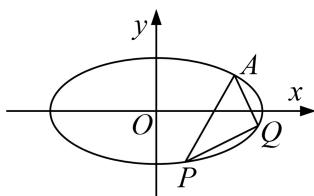

<!-- question-source:start -->
[例1] 已知椭圆 $C: \frac{x^2}{a^2} + \frac{y^2}{b^2} = 1 (a > b > 0)$ 的离心率为 $\frac{\sqrt{3}}{2}$ ，且过点 $A(2, 1)$ .

(1)求椭圆 C 的方程;

(2)若 $P$ ， $Q$ 是椭圆 $C$ 上的两个动点，且使 $\angle PAQ$ 的角平分线总垂直于 $x$ 轴，试判断直线 $PQ$ 的斜率是否为定值？若是，求出该值；若不是，说明理由.

[规范解答]
(1)因为椭圆 C 的离心率为 $\frac{\sqrt{3}}{2}$ ，且过点 A(2, 1)，

所以 $\frac{4}{a^2} +\frac{1}{b^2} = 1$ ， $\frac{c}{a} = \frac{\sqrt{3}}{2}$ 因为 $a^2 = c^2 +b^2$ ，解得 $b^{2} = 2$ ， $a^2 = 8$

所以椭圆 C 的方程为 $\frac{x^{2}}{8} + \frac{y^{2}}{2} = 1$ .

(2)因为 $\angle PAQ$ 的角平分线总垂直于 $x$ 轴，所以 $PA$ 与 $AQ$ 所在直线关于直线 $x=2$ 对称.

设直线 PA 的斜率为 k，则直线 AQ 的斜率为 -k.

所以直线 PA 的方程为 $y-1=k(x-2)$ ，直线 AQ 的方程为 $y-1=-k(x-2)$ .

设点 $P(x_{1}, y_{1})$ , $Q(x_{2}, y_{2})$ , 由 $\left\{\begin{aligned}x^{2}+4y^{2}&=8,\\ y&=k(x-2)+1,\end{aligned}\right.$

消去 y 得 $(1+4k^{2})x^{2}-8(2k^{2}-k)x+16k^{2}-16k-4=0$ ，①

因为点 $A(2, 1)$ 在椭圆 $C$ 上，所以 $x = 2$ 是方程①的一个根，

$2x_{1}=\frac{16k^{2}-16k-4}{1+4k^{2}}$ ，即 $x_{1}=\frac{8k^{2}-8k-2}{1+4k^{2}}$ 。同理 $x_{2}=\frac{8k^{2}+8k-2}{1+4k^{2}}$ 。

所以 $x_{1}-x_{2}=-\frac{16k}{1+4k^{2}}$ . 又 $y_{1}-y_{2}=k(x_{1}+x_{2})-4k=k\cdot\frac{16k^{2}-4}{1+4k^{2}}-4k=-\frac{8k}{1+4k^{2}}$ ,

所以直线 PQ 的斜率为 $k_{PQ}=\frac{y_{1}-y_{2}}{x_{1}-x_{2}}=\frac{1}{2}$ . 所以直线 PQ 的斜率为定值，该值为 $\frac{1}{2}$ .
<!-- question-source:end -->
