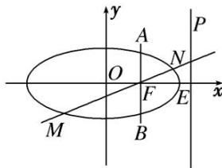

<!-- question-source:start -->
[例2] 已知椭圆 $C: \frac{x^2}{a^2} + \frac{y^2}{b^2} = 1 (a > b > 0)$ 的离心率为 $\frac{1}{2}$ ，右焦点为 $F$ ，右顶点为 $E$ ， $P$ 为直线 $x = \frac{5}{4} a$ 上的

任意一点，且 $(\overrightarrow{PF}+\overrightarrow{PE})\cdot\overrightarrow{EF}=2.$

(1)求椭圆 C 的方程;

(2)过 F 且垂直于 x 轴的直线 AB 与椭圆交于 A, B 两点(点 A 在第一象限), 动直线 l 与椭圆 C 交于 M, N 两点, 且 M, N 位于直线 AB 的两侧, 若始终保持 $\angle MAB = \angle NAB$ , 求证: 直线 MN 的斜率为定值.

[规范解答]
(1) 设 $P\left(\frac{5}{4}a, t\right)$ , $F(c, 0)$ , $E(a, 0)$ ,

则 $\overrightarrow{PF} = \left(c - \frac{5}{4} a, -t\right), \overrightarrow{PE} = \left(-\frac{a}{4}, -t\right), \overrightarrow{EF} = (c - a, 0)$ ,

所以 $(\overrightarrow{PF} +\overrightarrow{PE})\cdot \overrightarrow{EF} = \left(c - \frac{3}{2} a, - 2t\right)\cdot (c - a,0) = 2$ ，即 $\left(c - \frac{3}{2} a\right)\cdot (c - a) = 2$ ，又 $e = \frac{c}{a} = \frac{1}{2},$

所以 a=2, c=1, $b=\sqrt{3}$ ，从而椭圆 C 的方程为 $\frac{x^{2}}{4}+\frac{y^{2}}{3}=1$ .

(2)由
(1)知 $A\left(1, \frac{3}{2}\right)$ , 设 $M(x_1, y_1), N(x_2, y_2)$ , 设 $MN$ 的方程: $y = kx + m$ , 代入椭圆方程 $\frac{x^2}{4} + \frac{y^2}{3} = 1$ ,

得 $(4k^{2} + 3)x^{2} + 8kmx + 4m^{2} - 12 = 0$ ，所以 $x_{1} + x_{2} = -\frac{8km}{4k^{2} + 3}, x_{1}x_{2} = \frac{4m^{2} - 12}{4k^{2} + 3}$

又 M, N 是椭圆上位于直线 AB 两侧的动点，若始终保持 $\angle MAB = \angle NAB$ ,

则 $k_{AM} + k_{AN} = 0$ ，即 $\frac{y_1 - \frac{3}{2}}{x_1 - 1} +\frac{y_2 - \frac{3}{2}}{x_2 - 1} = 0,\left(kx_1 + m - \frac{3}{2}\right)(x_2 - 1) + \left(kx_2 + m - \frac{3}{2}\right)(x_1 - 1) = 0,$

即 $(2k-1)(2m+2k-3)=0$ ，得 $k=\frac{1}{2}$ 。故直线MN的斜率为定值 $\frac{1}{2}$ 。
<!-- question-source:end -->
