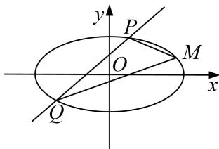

<!-- question-source:start -->
[例 5] 已知椭圆 C: $\frac{x^{2}}{a^{2}} + \frac{y^{2}}{b^{2}} = 1 (a > b > 0)$ 的离心率为 $\frac{\sqrt{3}}{2}$ ，且过点 M(4, 1).

(1)求椭圆 C 的方程;

(2)若直线 $l: y = x + m (m \neq 3)$ 与椭圆 $C$ 交于 $P, Q$ 两点，记直线 $MP, MQ$ 的斜率分别为 $k_{1}, k_{2}$ ，试探究 $k_{1} + k_{2}$ 是否为定值，若是，请求出该定值；若不是，请说明理由.

[规范解答]
(1)依题意， $\left\{\begin{aligned}\frac{c}{a}&=\frac{\sqrt{3}}{2}\\ \frac{16}{a^{2}}&+\frac{1}{b^{2}}=1\\ a^{2}&=b^{2}+c^{2}\end{aligned}\right.$ ，解得 $a^{2}=20,\quad b^{2}=5$ ．故椭圆 C 的方程为 $\frac{x^{2}}{20}+\frac{y^{2}}{5}=1$ ；

(2) $k_{1}+k_{2}=1$ ，下面给出证明：设 $P(x_{1},y_{1})$ ， $Q(x_{2},y_{2})$

将 $y = x + m$ 代入 $\frac{x^2}{20} +\frac{y^2}{5} = 1$ 并整理得 $5x^{2} + 8mx + 4m^{2} - 20 = 0,$

$\Delta=(8m)^{2}-20(4m^{2}-20)>0$ ，解得-5<m<5，且 $m\neq3$ .

故 $x_{1} + x_{2} = -\frac{8m}{5}, x_{1}\cdot x_{2} = \frac{4m^{2} - 20}{5},$

则 $k_{1}+k_{2}=\frac{y_{1}-1}{x_{1}-4}+\frac{y_{2}-1}{x_{2}-4}=\frac{(y_{1}-1)(x_{2}-4)+(y_{2}-1)(x_{1}-4)}{(x_{1}-4)(x_{2}-4)}=\frac{(x_{1}+m-1)(x_{2}-4)+(x_{2}+m-1)(x_{1}-4)}{(x_{1}-4)(x_{2}-4)}$ $=\frac{2x_{1}x_{2}+(m-5)(x_{1}+x_{2})}{(x_{1}-4)(x_{2}-4)}=\frac{\frac{2(4m^{2}-20)}{5}-\frac{8m(m-5)}{5}-8(m-1)}{(x_{1}-4)(x_{2}-4)}=0.$

故 $k_{1}+k_{2}$ 为定值，该定值为 0.
<!-- question-source:end -->
