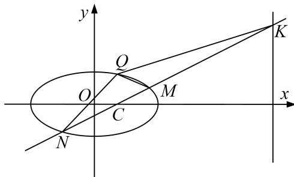

<!-- question-source:start -->
[例 12] 已知 $\triangle ABC$ 中， $B(-1,0)$ ， $C(1,0)$ ，AB=6，点P在AB上，且 $\angle BAC=\angle PCA$ .

(1)求点 P 的轨迹 E 的方程;

(2)若 $Q(1, \frac{8}{3})$ ，过点 $C$ 的直线与 $E$ 交于 $M$ ， $N$ 两点，与直线 $x = 9$ 交于点 $K$ ，记 $QM$ ， $QN$ ， $QK$ 的斜率分别为 $k_{1}$ ， $k_{2}$ ， $k_{3}$ ，试探究 $k_{1}$ ， $k_{2}$ ， $k_{3}$ 的关系，并证明.

[规范解答]
(1)如图三角形 ACP 中， $\angle BAC = \angle PCA$ ，所以 PA = PC，

所以 $PB + PC = PB + PA = AB = 6$ ,

所以点 P 的轨迹是以 B，C 为焦点，长轴为 4 的椭圆(不包含实轴的端点)，

所以点 P 的轨迹 E 的方程为 $\frac{x^{2}}{9} + \frac{y^{2}}{8} = 1 (x \neq \pm3)$ .

(2) $k_{1}$ ， $k_{2}$ ， $k_{3}$ 的关系： $k_{1}+k_{2}=2k_{3}$ .

证明：如图，设 $M(x_{1}, y_{1})$ ， $N(x_{2}, y_{2})$ ，

可设直线 MN 方程为 $y=k(x-1)$ ，则 $K(4,3k)$ ,

由 $\left\{\begin{aligned}\frac{x^{2}}{9}+\frac{y^{2}}{8}&=1,\\ y=k(x-1),\end{aligned}\right.$ 可得 $(9k^{2}+8)x^{2}-18k^{2}x+(9k^{2}-72)=0,$

$$
\therefore x _ {1} + x _ {2} = \frac {1 8 k ^ {2}}{9 k ^ {2} + 8}, x _ {1} x _ {2} = \frac {9 k ^ {2} - 7 2}{9 k ^ {2} + 8}.
$$

$$
k _ {1} = \frac {y _ {1} - \frac {8}{3}}{x _ {1} - 1} = \frac {k (x _ {1} - 1) - \frac {8}{3}}{x _ {1} - 1} = k - \frac {8}{3 (x _ {1} - 1)}, k _ {2} = k - \frac {8}{3 (x _ {2} - 1)}, k _ {3} = k - \frac {8 k - \frac {8}{3}}{9 - 1} = k - \frac {1}{3},
$$

$$
(k _ {1} - k _ {3}) + (k _ {2} - k _ {3}) = \frac {2}{3} - \frac {8}{3} \left(\frac {1}{x _ {1} - 1} + \frac {1}{x _ {2} - 1}\right) = \frac {2}{3} - \frac {8}{3} \frac {x _ {1} + x _ {2} - 2}{x _ {1} x _ {2} - (x _ {1} + x _ {2}) + 1},
$$

所以： $k_{1}+k_{2}=2k_{3}$ .
<!-- question-source:end -->
