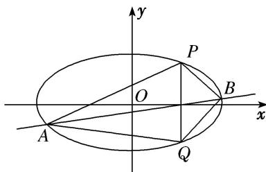

> [!faq]- 《专题18  斜率型定值型问题-圆锥曲线》例题解析
>
> > [!success]- **【答案】** 详见解析
>
> > [!note]- **【分析】**
> > 本题未单列分析。
>
> > [!note]- **【解析】**
> > (1)求椭圆 C 的方程;
> >
> > (2)如图，已知 $P(2, 3)$ ， $Q(2, -3)$ 是椭圆上的两点，A，B 是椭圆上位于直线 PQ 两侧的动点.
> > - **①**：若直线 AB 的斜率为 $\frac{1}{2}$ ，求四边形 APBQ 面积的最大值；
> > - **②**：当 A, B 运动时，满足 $\angle APQ = \angle BPQ$ ，试问直线 AB 的斜率是否为定值？请说明理由.
> >
> > 
> >
> > 1. 解析
> > (1)设椭圆 $C$ 的方程为 $\frac{x^2}{a^2} +\frac{y^2}{b^2} = 1(a > b > 0)$ ，\$\because\$抛物线的焦点为(0， $2\sqrt{3})$. $\therefore b = 2\sqrt{3}$. 由 \(\frac{c}{a} = \frac{1}{2}$ ， $a^2 = c^2 +b^2$ ，得 $a = 4$ ，\$\therefore\$椭圆 $C$ 的方程为 $\frac{x^2}{16} +\frac{y^2}{12} = 1$ .
> > (2)设 $A(x_{1},y_{1}),B(x_{2},y_{2})$ . ①设直线 $AB$ 的方程为 $y = \frac{1}{2} x + t$ ，代入 $\frac{x^2}{16} +\frac{y^2}{12} = 1$ ，得 $x^{2} + tx + t^{2} - 12 = 0$ 由 $\Delta >0$ ，解得 $-4 < t < 4$ ，\$\therefore x\_1 + x\_2 = -t, x\_1x\_2 = t^2 -12,\) $\therefore |x_1 - x_2| = \sqrt{(x_1 + x_2)^2 - 4x_1x_2} = \sqrt{t^2 - 4(t^2 - 12)} = \sqrt{48 - 3t^2}$ ：四边形 $APBQ$ 的面积 $S = \frac{1}{2}\times 6\times |x_1 - x_2| = 3\sqrt{48 - 3t^2}$ ：当 $t = 0$ 时， $S$ 取得最大值，且 $S_{\max} = 12\sqrt{3}$ . ②若 $\angle APQ = \angle BPQ$ ，则直线 $PA$ ， $PB$ 的斜率之和为0，设直线 $PA$ 的斜率为 $k$ ，则直线 $PB$ 的斜率为一 $k$ ，直线 $PA$ 的方程为 $y - 3 = k(x - 2)$ ，由 $\left\{\begin{array}{l}y - 3 = k(x - 2),\\ \frac{x^2}{16} +\frac{y^2}{12} = 1\end{array}\right.$ 消去 $y$ 得 $(3 + 4k^{2})x^{2} + 8k(3 - 2k)x + 4(3 - 2k)^{2} - 48 = 0,\quad \therefore x_{1} + 2 = \frac{8k(2k - 3)}{3 + 4k^{2}}$
> >
> > 将 $k$ 换成 $-k$ 可得 $x_{2} + 2 = \frac{-8k(-2k - 3)}{3 + 4k^{2}} = \frac{8k(2k + 3)}{3 + 4k^{2}},\therefore x_{1} + x_{2} = \frac{16k^{2} - 12}{3 + 4k^{2}},x_{1} - x_{2} = \frac{-48k}{3 + 4k^{2}},$ $\therefore k_{AB} = \frac{y_1 - y_2}{x_1 - x_2} = \frac{k(x_1 - 2) + 3 + k(x_2 - 2) - 3}{x_1 - x_2} = \frac{k(x_1 + x_2) - 4k}{x_1 - x_2} = \frac{1}{2},\therefore$ 直线 $AB$ 的斜率为定值 $\frac{1}{2}$
