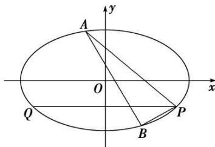

> [!faq]- 《专题18  斜率型定值型问题-圆锥曲线》例题解析
>
> > [!success]- **【答案】** 详见解析
>
> > [!note]- **【分析】**
> > 本题未单列分析。
>
> > [!note]- **【解析】**
> > (1)求椭圆 C 的标准方程;
> >
> > (2)设点 Q 在椭圆 C 上，且 PQ 与 x 轴平行，过 P 点作两条直线分别交椭圆 C 于 $A(x_{1}, y_{1})$ ， $B(x_{2}, y_{2})$ 两点，若直线 PQ 平分 $\angle APB$ ，求证：直线 AB 的斜率是定值，并求出这个定值.
> >
> > 
> >
> > 3. 解析
> > (1) 因为椭圆 $C$ 的离心率为 $\frac{c}{a} = \frac{\sqrt{3}}{2}$ ，所以 $\frac{a^2 - b^2}{a^2} = \frac{3}{4}$ ，即 $a^2 = 4b^2$ ，所以椭圆 $C$ 的方程可化为 $x^2 + 4y^2 = 4b^2$ ，又椭圆 $C$ 过点 $P(2, -1)$ ，所以 $4 + 4 = 4b^2$ ，解得 $b^2 = 2$ ， $a^2 = 8$ ，所以椭圆 $C$ 的标准方程为 $\frac{x^2}{8} + \frac{y^2}{2} = 1$ .
> >
> > (2)由题意，知直线 PA，PB 的斜率均存在且不为 0，设直线 PA 的方程为 $y+1=k(x-2)(k\neq0)$ ,
> >
> > 联立方程，得 $\left\{ \begin{array}{l} x^2 + 4y^2 = 8, \\ y = k(x - 2) - 1, \end{array} \right.$ 消去 $y$ 得 $(1 + 4k^2)x^2 - 8(2k^2 + k)x + 16k^2 + 16k - 4 = 0,$
> >
> > 所以 $2x_{1}=\frac{16k^{2}+16k-4}{1+4k^{2}}$ ，即 $x_{1}=\frac{8k^{2}+8k-2}{1+4k^{2}}$ .
> >
> > 因为直线 PQ 平分 $\angle APB$ ，且 PQ 与 x 轴平行，所以直线 PA 与直线 PB 的斜率互为相反数，
> >
> > 则直线 $PB$ 的方程为 $y + 1 = -k(x - 2)(k \neq 0)$ ，同理可得 $x_{2} = \frac{8k^{2} - 8k - 2}{1 + 4k^{2}}$ .
> >
> > 又 $\left\{ \begin{array}{l} y_{1} + 1 = k(x_{1} - 2), \\ y_{2} + 1 = -k(x_{2} - 2), \end{array} \right.$ 所以 $y_{1} - y_{2} = k(x_{1} + x_{2}) - 4k,$
> >
> > 即 $y_{1} - y_{2} = k(x_{1} + x_{2}) - 4k = k\cdot \frac{16k^{2} - 4}{1 + 4k^{2}} -4k = -\frac{8k}{1 + 4k^{2}},$ $x_{1} - x_{2} = \frac{16k}{1 + 4k^{2}}.$
> >
> > 所以直线 AB 的斜率 $k_{AB}=\frac{y_{1}-y_{2}}{x_{1}-x_{2}}=\frac{-\frac{8k}{1+4k^{2}}}{\frac{16k}{1+4k^{2}}}=-\frac{1}{2}$ ，为定值.
