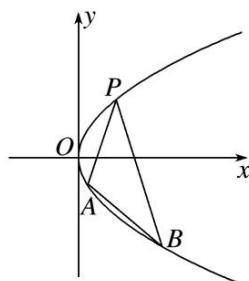

<!-- question-source:start -->
[例 3] 如图所示，抛物线关于 x 轴对称，它的顶点在坐标原点，点 $P(1, 2)$ ， $A(x_{1}, y_{1})$ ， $B(x_{2}, y_{2})$ 均在抛物线上.

(1)求抛物线的方程及其准线方程;

(2)当 $PA$ 与 $PB$ 的斜率存在且倾斜角互补时, 证明: 直线 $AB$ 的斜率为定值.

(2)因为 PA 与 PB 的斜率存在且倾斜角互补，所以 $k_{PA} = -k_{PB}$ ，即 $\frac{y_{1}-2}{x_{1}-1} = -\frac{y_{2}-2}{x_{2}-1}$ .

又 $A(x_{1}, y_{1})$ ， $B(x_{2}, y_{2})$ 均在抛物线上，所以 $x_{1}=\frac{y_{1}^{2}}{4}$ ， $x_{2}=\frac{y_{2}^{2}}{4}$ ，从而 $\frac{y_{1}-2}{\frac{y_{1}^{2}}{4}-1}=-\frac{y_{2}-2}{\frac{y_{2}^{2}}{4}-1}$ ，

即 $\frac{4}{y_1 + 2} = -\frac{4}{y_2 + 2}$ ，得 $y_{1} + y_{2} = -4$ ，故直线 $AB$ 的斜率 $k_{AB} = \frac{y_1 - y_2}{x_1 - x_2} = \frac{4}{y_1 + y_2} = -1$ ，为定值.
<!-- question-source:end -->

![[高中/总复习/专题/圆锥曲线/专题18  斜率型定值型问题-圆锥曲线/专题18_斜率型定值型问题/例题选讲/例题/answers/Q00032541A1.md]]
