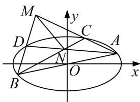

<!-- question-source:start -->
[例 4] 如图，在平面直角坐标系 xOy 中，椭圆 E: $\frac{x^{2}}{a^{2}} + \frac{y^{2}}{b^{2}} = 1 (a > b > 0)$ 的离心率为 $\frac{\sqrt{2}}{2}$ ，直线 l: $y = \frac{1}{2}x$ 与椭圆 E 相交于 A, B 两点， $AB = 4\sqrt{5}$ ，C, D 是椭圆 E 上异于 A, B 两点，且直线 AC, BD 相交于点 M，直线 AD, BC 相交于点 N.

(1)求 $a, b$ 的值；

(2)求证：直线 $MN$ 的斜率为定值.

(2)由(1)知，椭圆 E 的方程为 $\frac{x^{2}}{24} + \frac{y^{2}}{12} = 1$ ，从而 $A(4, 2)$ ， $B(-4, -2)$ ;

①当 CA, CB, DA, DB 斜率都存在时，设直线 CA, DA 的斜率分别为 $k_{1}$ , $k_{2}$ , $C(x_{0}, y_{0})$ ,

显然 $k_{1} \neq k_{2}$ ; $k_{1} k_{BC} = \frac{y_{0} - 2}{x_{0} - 4} \cdot \frac{y_{0} + 2}{x_{0} + 4} = \frac{y_{0}^{2} - 4}{x_{0}^{2} - 16} = \frac{8 - \frac{x_{0}^{2}}{2}}{x_{0}^{2} - 16} = -\frac{1}{2}$ , 所以 $k_{BC} = -\frac{1}{2k_{1}}$ ; 同理 $k_{DB} = -\frac{1}{2k_{2}}$ ,

于是直线 $AD$ 的方程为 $y - 2 = k_{2}(x - 4)$ ，直线 $BC$ 的方程为 $y + 2 = -\frac{1}{2k_1} (x + 4)$

$\therefore \left\{ \begin{array}{l} y + 2 = -\frac{1}{2k_1}(x + 4) \\ y - 2 = k_2(x - 4) \end{array} \right.$ ，解得 $\left\{ \begin{array}{l} x = \frac{8k_1k_2 - 8k_1 - 4}{2k_1k_2 + 1} \\ y = \frac{-4k_1k_2 - 8k_2 + 2}{2k_1k_2 + 1} \end{array} \right.$

从而点 N 的坐标为 $\left(\frac{8k_{1}k_{2}-8k_{1}-4}{2k_{1}k_{2}+1},\frac{-4k_{1}k_{2}-8k_{2}+2}{2k_{1}k_{2}+1}\right)$ ,

用 $k_{2}$ 代 $k_{1}$ ， $k_{1}$ 代 $k_{2}$ 得点 M 的坐标为 $\left(\frac{8k_{1}k_{2}-8k_{2}-4}{2k_{1}k_{2}+1},\frac{-4k_{1}k_{2}-8k_{1}+2}{2k_{1}k_{2}+1}\right)$ ;

$$
\therefore k _ {M N} = \frac {\frac {- 4 k _ {1} k _ {2} - 8 k _ {2} + 2}{2 k _ {1} k _ {2} + 1} - \frac {- 4 k _ {1} k _ {2} - 8 k _ {1} + 2}{2 k _ {1} k _ {2} + 1}}{\frac {8 k _ {1} k _ {2} - 8 k _ {1} - 4}{2 k _ {1} k _ {2} + 1} - \frac {8 k _ {1} k _ {2} - 8 k _ {2} - 4}{2 k _ {1} k _ {2} + 1}} = \frac {8 (k _ {1} - k _ {2})}{8 (k _ {2} - k _ {1})} = - 1.
$$

即直线 MN 的斜率为定值 -1;

②当 $CA, CB, DA, DB$ 中，有直线的斜率不存在时，根据题设要求，至多有一条直线斜率不存在，故不妨设直线 $CA$ 的斜率不存在，从而 $C(4, -2)$ ；仍然设 $DA$ 的斜率为 $k_2$ ，由①知 $k_{DB} = -\frac{1}{2k_2}$ ；此时 $CA: x = 4, DB: y + 2 = -\frac{1}{2k_2}(x + 4)$ ，它们交点 $M(4, -\frac{4}{k_2} - 2)$ ；

$BC: y = -2, AD: y - 2 = k_2(x - 4)$ ，它们交点 $N(4 - \frac{4}{k_2}, -2)$ ，从而 $k_{MN} = -1$ 也成立；

由①②可知，直线 MN 的斜率为定值 -1；
<!-- question-source:end -->

![[高中/总复习/专题/圆锥曲线/专题18  斜率型定值型问题-圆锥曲线/专题18_斜率型定值型问题/例题选讲/例题/answers/Q00032542A1.md]]
