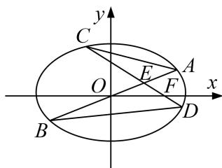

<!-- question-source:start -->
[例 7] 如图，在平面直角坐标系 xOy 中，椭圆 C: $\frac{x^{2}}{a^{2}} + \frac{y^{2}}{b^{2}} = 1 (a > b > 0)$ 的右焦点为 $F(1, 0)$ ，离心率为 $\frac{\sqrt{2}}{2}$ 。分别过 O，F 的两条弦 AB，CD 相交于点 E（异于 A，C 两点），且 OE = OF。

(1)求椭圆的方程;

(2)求证：直线 $AC$ ， $BD$ 的斜率之和为定值.

(2)设直线 AB 的方程为 y=kx，②，直线 CD 的方程为 $y=-k(x-1)$ ，③

由①②得，点 A, B 的横坐标为 $\pm\frac{\sqrt{2}}{2k^{2}+1}$ ，由①③得，点 C, D 的横坐标为 $\frac{2k^{2}\pm\sqrt{2(k^{2}+1)}}{2k^{2}+1}$ ,

$A(x_{1}, kx_{1}), B(x_{2}, kx_{2}), C(x_{3}, k(1 - x_{3})), D(x_{4}, k(1 - x_{4}))$

则直线 $AC$ ，BD的斜率之和为 $\frac{kx_1 - k(1 - x_3)}{x_1 - x_3} +\frac{kx_2 - k(1 - x_4)}{x_2 - x_4} = k\frac{(x_1 + x_3 - 1)(x_2 - x_4) + (x_1 - x_3)(x_2 + x_4 - 1)}{(x_1 - x_3)(x_2 - x_4)}$

$$
= k \frac {2 \left(x _ {1} x _ {2} - x _ {3} x _ {4}\right) - \left(x _ {1} + x _ {2}\right) + \left(x _ {3} + x _ {4}\right)}{\left(x _ {1} - x _ {3}\right) \left(x _ {2} - x _ {4}\right)} = k \frac {2 \left(\frac {- 2}{2 k ^ {2} + 1} - \frac {2 \left(k ^ {2} - 1\right)}{2 k ^ {2} + 1}\right) - 0 + \frac {4 k ^ {2}}{2 k ^ {2} + 1}}{\left(x _ {1} - x _ {3}\right) \left(x _ {2} - x _ {4}\right)} = 0.
$$
<!-- question-source:end -->

![[高中/总复习/专题/圆锥曲线/专题18  斜率型定值型问题-圆锥曲线/专题18_斜率型定值型问题/例题选讲_2/例题/answers/Q00032550A1.md]]
