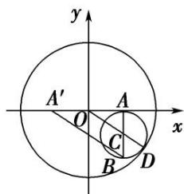

> [!faq]- 教师版例题解析
>
> > [!success]- **【答案】** 详见解析
>
> > [!note]- **【分析】**
> > 本题未单列分析。
>
> > [!note]- **【解析】**
> > [规范解答] (1)如图，设以线段 AB 为直径的圆的圆心为 C，取 $A'(-1, 0)$ .
> > 
> > 依题意，圆 C 内切于圆 O，设切点为 D，则 O，C，D 三点共线，
> > ∵O为AA'的中点，C为AB中点，∴ $|A'B|=2|OC|$ .
> > $$
> > \therefore | B A ^ {\prime} | + | B A | = 2 O C + 2 A C = 2 O C + 2 C D = 2 O D = 4 > | A A ^ {\prime} | = 2,
> > $$
> > ∴动点 B 的轨迹是以 A， $A'$ 为焦点，长轴长为 4 的椭圆，
> > 设其方程为 $\frac{x^{2}}{a^{2}}+\frac{y^{2}}{b^{2}}=1(a>b>0)$ ，则2a=4，2c=2，∴a=2，c=1，∴ $b^{2}=a^{2}-c^{2}=3$ ，
> > ∴动点 B 的轨迹方程为 $\frac{x^{2}}{4} + \frac{y^{2}}{3} = 1$ .
