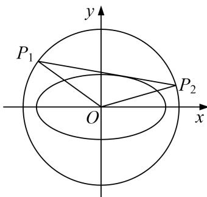

<!-- question-source:start -->
[例 9] 已知椭圆 C: $\frac{x^{2}}{a^{2}}+\frac{y^{2}}{b^{2}}=1(a>b>0)$ 的离心率为 $\frac{1}{2}$ ，点 A(1. $\frac{3}{2}$ ) 在椭圆 C 上.

(1)求椭圆 C 的方程;

(2)设动直线 l 与椭圆 C 有且仅有一个公共点，判断是否存在以原点 O 为圆心的圆，满足此圆与 l 相交两点 $P_{1}$ ， $P_{2}$ ，(两点均不在坐标轴上)，且使得直线 $OP_{1}$ ， $OP_{2}$ 的斜率之积为定值？若存在，求此圆的方程与定值；若不存在，请说明理由.

(2)结论：存在符合条件的圆，且此圆的方程为 $x^{2}+y^{2}=7$ .

证明如下:

假设存在符合条件的圆，且设此圆的方程为 $x^{2}+y^{2}=r^{2}(r>0)$ .

当直线 l 的斜率存在时，设 l 的方程为 $y=kx+m$ ，

由方程组 $\left\{ \begin{array}{l} y = kx + m \\ \frac{x^2}{4} + \frac{y^2}{3} = 1 \end{array} \right.$ ，得 $(4k^2 + 3)x^2 + 8kmx + 4m^2 - 12 = 0$

因为直线 l 与椭圆有且仅有一个公共点，所以 $\Delta_{1}=(8km)^{2}-4(4k^{2}+3)(4m^{2}-12)=0$ ，即 $m^{2}=4k^{2}+3$ .
由方程组 $\left\{\begin{aligned}y=kx+m\\ x^{2}+y^{2}&=r^{2}\end{aligned}\right.$ ，得 $(k^{2}+1)x^{2}+2kmx+m^{2}-r^{2}=0$ ，

则 $\Delta_{1}=(2km)^{2}-4(k^{2}+1)(m^{2}-r^{2})>0,$

设 $P_{1}(x_{1}, y_{1})$ ， $P_{2}(x_{2}, y_{2})$ ，则 $x_{1} + x_{2} = \frac{-2km}{1 + k^{2}}$ ， $x_{1}x_{2} = \frac{m^{2} - r^{2}}{1 + k^{2}}$ .

设直线 $OP_{1}$ ， $OP_{2}$ 的斜率分别为 $k_{1}$ ， $k_{2}$ ，

$$
k _ {1} \cdot k _ {2} = \frac {y _ {1} y _ {2}}{x _ {1} x _ {2}} = \frac {(k x _ {1} + m) (k _ {2} x + m)}{x _ {1} x _ {2}} = \frac {k ^ {2} x _ {1} x _ {2} + k m (x _ {1} + x _ {2}) + m ^ {2}}{x _ {1} x _ {2}} = \frac {k ^ {2} \frac {m ^ {2} - r ^ {2}}{1 + k ^ {2}} + k m \frac {- 2 k m}{1 + k ^ {2}} + m ^ {2}}{\underline {{m ^ {2} - r ^ {2}}}} = \frac {m ^ {2} - r ^ {2} k ^ {2}}{m ^ {2} - r ^ {2}}.
$$

将 $m^2 = 4k^2 +3$ 代入上式得 $k_{1}k_{2} = \frac{(4 - r^{2})k^{2} + 3}{4k^{2} + 3 - r^{2}}$ 要使得 $k_{1}k_{2}$ 为定值，则 $\frac{4 - r^2}{4} = \frac{3}{3 - r^2}$ 即 $r^2 = 7$

所以当圆的方程为 $x^{2}+y^{2}=7$ 时，圆与 l 的交点 $P_{1}$ ， $P_{2}$ 满足 $k_{1}k_{2}$ 为定值 $-\frac{3}{4}$ .

当直线 l 的斜率不存在时，由题意知 l 的方程为 $x=\pm2$ ，

此时圆与 l 的交点 $P_{1}$ ， $P_{2}$ 也满足 $k_{1}k_{2}$ 为定值 $-\frac{3}{4}$ .

综上：当圆的方程为 $x^{2}+y^{2}=7$ 时，圆与 l 的交点 $P_{1}$ ， $P_{2}$ 满足 $k_{1}k_{2}$ 为定值 $-\frac{3}{4}$ .
<!-- question-source:end -->

![[高中/总复习/专题/圆锥曲线/专题18  斜率型定值型问题-圆锥曲线/专题18_斜率型定值型问题/例题选讲_3/例题/answers/Q00032555A1.md]]
