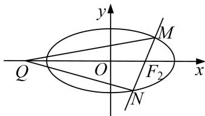

<!-- question-source:start -->
[例 13] 已知圆 $F_{1}$ : $(x+1)^{2}+y^{2}=r^{2}(1\leq r\leq3)$ ，圆 $F_{2}$ : $(x-1)^{2}+y^{2}=(4-r)^{2}$ .

(1)证明：圆 $F_{1}$ 与圆 $F_{2}$ 有公共点，并求公共点的轨迹 $E$ 的方程；

(2)已知点 $Q(m,0)(m < 0)$ ，过点 $F_{2}$ 斜率为 $k(k \neq 0)$ 的直线与(1)中轨迹 $E$ 相交于 $M, N$ 两点，记直线 $QM$ 的斜率为 $k_{1}$ ，直线 $QN$ 的斜率为 $k_{2}$ ，是否存在实数 $m$ 使得 $k(k_{1} + k_{2})$ 为定值？若存在，求出 $m$ 的值，若不存在，说明理由.

(2)过 $F_{2}$ 点且斜率为 k 的直线方程为 $y=k(x-1)$ ，设 $M(x_{1}, y_{1})$ ， $N(x_{2}, y_{2})$ .

由 $\left\{\begin{aligned}y&=k(x-1)\\ \frac{x^{2}}{4}&+\frac{y^{2}}{3}=1\end{aligned}\right.$ 消去 y 得到 $(4k^{2}+3)x^{2}-8k^{2}x+4k^{2}-12=0$ .

则 $x_{1} + x_{2} = \frac{8k^{2}}{4k^{2} + 3}, x_{1}x_{2} = \frac{4k^{2} - 12}{4k^{2} + 3}$ . ①

因为 $k_{1}=\frac{y_{1}}{x_{1}-m},\quad k_{2}=\frac{y_{2}}{x_{2}-m},$

$$
k \left(k _ {1} + k _ {2}\right) = k \left(\frac {y _ {1}}{x _ {1} - m} + \frac {y _ {2}}{x _ {2} - m}\right) = k \left(\frac {k \left(x _ {1} - 1\right)}{x _ {1} - m} + \frac {k \left(x _ {2} - 1\right)}{x _ {2} - m}\right) = k ^ {2} \left(\frac {x _ {1} - 1}{x _ {1} - m} + \frac {x _ {2} - 1}{x _ {2} - m}\right)
$$

$$
= k ^ {2} \frac {(x _ {1} - 1) (x _ {2} - m) + (x _ {2} - 1) (x _ {1} - m)}{(x _ {1} - m) (x _ {2} - m)} = k ^ {2} \frac {2 x _ {1} x _ {2} - (m + 1) (x _ {1} + x _ {2}) + 2 m}{x _ {1} x _ {2} - m (x _ {1} + x _ {2}) + m ^ {2}},
$$

将①式代入整理得 $k(k_{1} + k_{2}) = \frac{(6m - 24)k^{2}}{4(m - 1)^{2}k^{2} + 3m^{2} - 12}$

因为 m<0，所以当 $3m^{2}-12=0$ 时，即 m=-2 时， $k(k_{1}+k_{2})=-1$ .

即存在实数 m=-2 使得 $k(k_{1}+k_{2})=-1$ .
<!-- question-source:end -->

![[高中/总复习/专题/圆锥曲线/专题18  斜率型定值型问题-圆锥曲线/专题18_斜率型定值型问题/例题选讲_4/例题/answers/Q00032562A1.md]]
