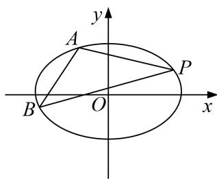

<!-- question-source:start -->
2. 已知直线 $l$ 经过椭圆 $C: \frac{x^2}{a^2} + \frac{y^2}{b^2} = 1 (a > b > 0)$ 的左焦点和下顶点，坐标原点 $O$ 到直线 $l$ 的距离为 $\frac{a}{2}$ .

(1)求椭圆 C 的离心率;

(2)若椭圆 $C$ 经过点 $P(2, 1)$ , 点 $A, B$ 是椭圆 $C$ 上的两个动点, 且 $\angle APB$ 的角平分线总是垂直于 $y$ 轴,试问: 直线 $AB$ 的斜率是否为定值? 若是, 求出该定值; 若不是, 请说明理由.

<!-- question-source:end -->

![[高中/总复习/专题/圆锥曲线/专题18  斜率型定值型问题-圆锥曲线/专题18_斜率型定值型问题/对点训练/题目/answers/Q00032544A1.md]]
