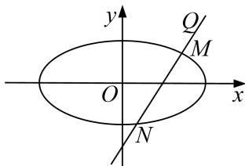

<!-- question-source:start -->
5. 已知椭圆 $C: \frac{x^2}{a^2} + \frac{y^2}{b^2} = 1 (a > b > 0)$ , $c = \sqrt{3}$ , 左、右焦点为 $F_1, F_2$ , 点 $P, A, B$ 在椭圆 $C$ 上, 且点 $A, B$ 关于原点对称, 直线 $PA, PB$ 的斜率的乘积为 $-\frac{1}{4}$ .

(1)求椭圆 C 的方程;

(2)已知直线 l 经过点 $Q(2, 2)$ ，且与椭圆 C 交于不同的两点 M，N，若 $|QM||QN| = \frac{16}{3}$ ，判断直线 l 的斜率是否为定值？若是，请求出该定值；若不是，请说明理由.

<!-- question-source:end -->

![[高中/总复习/专题/圆锥曲线/专题18  斜率型定值型问题-圆锥曲线/专题18_斜率型定值型问题/对点训练/题目/answers/Q00032547A1.md]]
