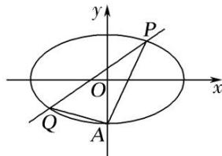

<!-- question-source:start -->
6. 如图，椭圆 $E: \frac{x^2}{a^2} + \frac{y^2}{b^2} = 1 (a > b > 0)$ 经过点 $A(0, -1)$ ，且离心率为 $\frac{\sqrt{2}}{2}$ .

(1)求椭圆 E 的方程;

(2)经过点(1, 1)，且斜率为 $k$ 的直线与椭圆 $E$ 交于不同的两点 $P$ ， $Q$ (均异于点 $A$ ），证明：直线 $AP$ 与 $AQ$ 的斜率之和为定值.

<!-- question-source:end -->

![[高中/总复习/专题/圆锥曲线/专题18  斜率型定值型问题-圆锥曲线/专题18_斜率型定值型问题/对点训练_2/题目/answers/Q00032551A1.md]]
