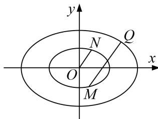

<!-- question-source:start -->
12. 已知椭圆 $C: \frac{x^2}{a^2} + \frac{y^2}{b^2} = 1 (a > b > 0)$ 的离心率为 $\frac{\sqrt{6}}{3}$ , $F_1, F_2$ , 是椭圆 $C$ 的左、右焦点, $P$ 是椭圆 $C$ 上的一个动点, 且 $\triangle PF_1F_2$ 面积的最大值为 $10\sqrt{2}$ .

(1)求椭圆 C 的方程;

(2)若 $Q$ 是椭圆 $C$ 上的一个动点，点 $M, N$ 在椭圆 $\frac{x^2}{3} + y^2 = 1$ 上， $O$ 为原点，点 $Q, M, N$ 满足 $\overrightarrow{OM} = \overrightarrow{OM} + 3\overrightarrow{ON}$ ，则直线 $OM$ 与直线 $ON$ 的斜率之积是否为定值？若是，求出该定值，若不是，请说明理由.

<!-- question-source:end -->

![[高中/总复习/专题/圆锥曲线/专题18  斜率型定值型问题-圆锥曲线/专题18_斜率型定值型问题/对点训练_3/题目/answers/Q00032560A1.md]]
