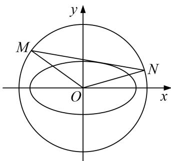

> [!faq]- 教师版对点训练解析
>
> > [!success]- **【答案】** 详见解析
>
> > [!note]- **【分析】**
> > 本题未单列分析。
>
> > [!note]- **【解析】**
> > 解析 (1)椭圆 C 的上顶点为 $D(0, b)$ ，右焦点 $F_{2}(1, 0)$ ，点 E 的坐标为 $(x, y)$ .
> > $\because |DF_{2}|=3|F_{2}E|$ ，可得 $\overrightarrow{DF_{2}}=3\overrightarrow{F_{2}E}$ ，又 $\overrightarrow{DF_{2}}=(1,-b)$ ， $\overrightarrow{F_{2}E}=(x-1,y)$ ,$\therefore \left\{ \begin{array}{l} x = \frac{4}{3}, \\ y = -\frac{b}{3}, \end{array} \right.$ 代入 $\frac{x^2}{a^2} + \frac{y^2}{b^2} = 1$ ，可得 $\frac{\left(\frac{4}{3}\right)^2}{a^2} + \frac{\left(-\frac{b}{3}\right)^2}{b^2} = 1$ ，又 $a^2 - b^2 = 1$ ，解得 $a^2 = 2, b^2 = 1$ ，即椭圆 $C$ 的标准方程为 $\frac{x^2}{2} + y^2 = 1$ .
> > (2) 设 $A(x_1, y_1), B(x_2, y_2), H(-\sqrt{2}, 0), M(3, y_M), N(3, y_N)$ .
> > 由题意可设直线 $AB$ 的方程为 $x = my + 1$ ，联立 $\left\{ \begin{array}{l} x = my + 1, \\ \frac{x^2}{2} + y^2 = 1, \end{array} \right.$ 消去 $x$ ，得 $(m^2 + 2)y^2 + 2my - 1 = 0$ ， $\Delta = 4m^2 + 4(m^2 + 2) > 0$ 恒成立。 $\therefore \left\{ \begin{array}{l} y_1 + y_2 = -\frac{2m}{m^2 + 2}, \\ y_1y_2 = \frac{-1}{m^2 + 2}. \end{array} \right.$ 根据 $H, A, M$ 三点共线，可得 $\frac{y_M}{3 + \sqrt{2}} = \frac{y_1}{x_1 + \sqrt{2}}, \therefore y_M = \frac{y_1(3 + \sqrt{2})}{x_1 + \sqrt{2}}$ ，同理可得 $y_N = \frac{y_2(3 + \sqrt{2})}{x_2 + \sqrt{2}}$ ， $\therefore M, N$ 的坐标分别为 $\left[3, \frac{y_1(3 + \sqrt{2})}{x_1 + \sqrt{2}}\right], \left[3, \frac{y_2(3 + \sqrt{2})}{x_2 + \sqrt{2}}\right]$ , $\therefore k_1k_2 = \frac{y_M - 0}{3 - 1} \cdot \frac{y_N - 0}{3 - 1} = \frac{1}{4} y_M y_N = \frac{1}{4} \cdot \frac{y_1(3 + \sqrt{2})}{x_1 + \sqrt{2}} \cdot \frac{y_2(3 + \sqrt{2})}{x_2 + \sqrt{2}} = \frac{y_1y_2(3 + \sqrt{2})^2}{4(my_1 + 1 + \sqrt{2})(my_2 + 1 + \sqrt{2})}$ $= \frac{y_1y_2(3 + \sqrt{2})^2}{4[m^2y_1y_2 + (1 + \sqrt{2})m(y_1 + y_2) + (1 + \sqrt{2})^2]} = \frac{\frac{-11 - 6\sqrt{2}}{m^2 + 2}}{4\left[\frac{-m^2}{m^2 + 2} + \frac{-2(1 + \sqrt{2})m^2}{m^2 + 2} + 3 + 2\sqrt{2}\right]}$ $= \frac{\frac{-11 - 6\sqrt{2}}{m^2 + 2}}{4\times\frac{6 + 4\sqrt{2}}{m^2 + 2}} = \frac{4\sqrt{2} - 9}{8}$ . $\therefore k_1$ 与 $k_2$ 之积为定值，且该定值是 $\frac{4\sqrt{2} - 9}{8}$ .
> > 已知椭圆 $C: \frac{x^2}{a^2} + \frac{y^2}{b^2} = 1 (a > b > 0)$ 经过 $A(1, \frac{\sqrt{2}}{2}), B(\frac{\sqrt{2}}{2}, -\frac{\sqrt{3}}{2})$ 两点， $O$ 为坐标原点.
> > (1)求椭圆 C 的标准方程;
> > (2)设动直线 l 与椭圆 C 有且仅有一个公共点，且与圆 O: $x^{2}+y^{2}=3$ 相交于 M, N 两点试问直线 OM 与 ON 的斜率之积 $k_{OM}k_{ON}$ 是否为定值？若是，求出该定值；若不是，说明理由.
> > 
> > 10. 解析 (1)依题意， $\left\{ \begin{array}{l} \frac{1}{a^2} + \frac{1}{b^2} = 1 \\ \frac{1}{2} + \frac{3}{b^2} = 1 \\ \frac{1}{a^2} + \frac{4}{b^2} = 1 \end{array} \right.$ ，解得 $\left\{ \begin{array}{l} a^2 = 2 \\ b^2 = 1 \end{array} \right.$ ，所以椭圆方程为 $\frac{x^2}{2} + y^2 = 1$ 。
> > (2)当直线 l 的斜率不存在时，直线 l 的方程为 $x=\pm\sqrt{2}$ .
> > 若直线 l 的方程为 $x=\sqrt{2}$ ，则 M, N 的坐标为 $(\sqrt{2}, -1)(\sqrt{2}, 1)$ ， $k_{OM}\cdot k_{ON}=-\frac{1}{2}$ .
> > 若直线 l 的方程为 $x = -\sqrt{2}$ ，则 M, N 的坐标为 $(- \sqrt{2}, -1)(-\sqrt{2}, 1)$ ， $k_{OM}\cdot k_{ON}=-\frac{1}{2}$ .
> > 当直线 l 的斜率存在时，可设直线 l: $y=kx+m$ ,
> > 与椭圆方程联立可得 $(1+2k^{2})x^{2}+4kmx+2m^{2}-2=0$ 由相切可得 $\Delta_{1}=8(2k^{2}-m^{2}+1)=0$ 。即 $m^{2}=2k^{2}+1$ 。
> > 又 $\left\{\begin{aligned}y=kx+m\\ x^{2}+y^{2}&=3\end{aligned}\right.$ ，消去 y 得 $(1+k^{2})x^{2}+2kmx+m^{2}-3=0$ $\Delta_{2}=(2km)^{2}-4(k^{2}+1)(m^{2}-3)=4(3k^{2}-m^{2}+3)=4(k^{2}+2)>0,$ 设 $M(x_{1}, y_{1}), N(x_{2}, y_{2})$ ，则 $x_{1}+x_{2}=\frac{-2km}{1+k^{2}}, x_{1}x_{2}=\frac{m^{2}-3}{1+k^{2}}$ $\therefore y_{1}y_{2}=(kx_{1}+m)(kx_{2}+m)=k^{2}x_{1}x_{2}+km(x_{1}+x_{2})+m^{2}=\frac{m^{2}-3k^{2}}{1+k^{2}}$ $k_{OM}\cdot k_{ON}=\frac{y_{1}y_{2}}{x_{1}x_{2}}=\frac{m^{2}-3k^{2}}{m^{2}-3}=\frac{2k^{2}+1-3k^{2}}{2k^{2}+1-3}=\frac{1-k^{2}}{2k^{2}-2}=-\frac{1}{2}.$ 故 $k_{OM}\cdot k_{ON}$ 为定值且定值为 $-\frac{1}{2}$ .
> > 综上， $k_{OM}\cdot k_{ON}$ 为定值且定值为 $-\frac{1}{2}$ .
