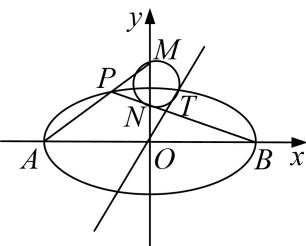

<!-- question-source:start -->
[例 3] 已知椭圆 C: $\frac{x^{2}}{a^{2}}+\frac{y^{2}}{b^{2}}=1(a>b>0)$ 的左、右顶点分别为 A, B, 左焦点为 F, O 为原点, 点 P 为椭圆 C 上不同于 A、B 的任一点, 若直线 PA 与 PB 的斜率之积为 $-\frac{3}{4}$ , 且椭圆 C 经过点 $(1, \frac{3}{2})$ .

(1)求椭圆 C 的方程;

(2)若 $P$ 点不在坐标轴上，直线 $PA, PB$ 交 $y$ 轴于 $M, N$ 两点，若直线 $OT$ 与过点 $M, N$ 的圆 $G$ 相切。切点为 $T$ ，问切线长 $|OT|$ 是否为定值，若是，求出定值，若不是，请说明理由。

[规范解答]
(1) 设 $P(x, y)$ ，由题意得 $A(-a, 0)$ ， $B(a, 0)$ ， $k_{AP} \cdot k_{BP} = \frac{y}{x + a} \cdot \frac{y}{x - a} = \frac{y^{2}}{x^{2} - a^{2}}$

$\therefore \frac{y^2}{x^2 - a^2} = -\frac{3}{4}$ , 而 $\frac{x^2}{a^2} + \frac{y^2}{b^2} = 1$ 得, $b^2 = \frac{3}{4} a^2$ ①,

又过 $(1, \frac{3}{2})$ ， $\therefore \frac{1}{a^2} + \frac{9}{4b^2} = 1$ ②，所以由①②得： $a^2 = 4$ ， $b^2 = 3$ ；

所以椭圆 C 的方程为 $\frac{x^{2}}{4} + \frac{y^{2}}{3} = 1$ ;

(2)由
(1)得： $A(-2,0)$ ， $B(2,0)$ ，设 $P(m,n)$ ， $\frac{m^{2}}{4}+\frac{n^{2}}{3}=1$ ，则直线的方程 $PA: y = \frac{n}{m + 2} (x + 2)$ ，令 $x = 0$ ，则 $y = \frac{2n}{m + 2}$ ，所以 $M(0, \frac{2n}{m + 2})$ ，直线 $PB$ 的方程： $y = \frac{n}{m - 2} (x - 2)$ ，令 $x = 0$ ，则 $y = \frac{-n}{m - 2}$ ，所以 $N(0, \frac{-2n}{m - 2})$ ， $\because \triangle OTN \sim \triangle OMT$ ， $\therefore \frac{OT}{OM} = \frac{ON}{OT}$ （圆的切割线定理），再联立 $\frac{m^2}{4} + \frac{n^2}{3} = 1$ ， $\therefore OT^2 = |ON||OM| = |\frac{4n^2}{m^2 - 4}| = 3$ 。
<!-- question-source:end -->
