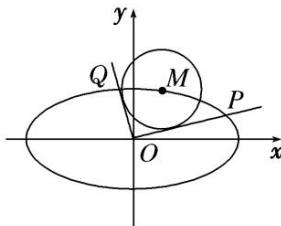

<!-- question-source:start -->
[例 8] 如图，已知 $M(x_{0}, y_{0})$ 是椭圆 C: $\frac{x^{2}}{6} + \frac{y^{2}}{3} = 1$ 上的任一点，从原点 O 向圆 M: $(x - x_{0})^{2} + (y - y_{0})^{2} = 2$ 作两条切线，分别交椭圆于点 P, Q.

(1)若直线 $OP$ ， $OQ$ 的斜率存在，并记为 $k_{1}$ ， $k_{2}$ ，求证： $k_{1}k_{2}$ 为定值；

(2)试问 $|OP|^{2}+|OQ|^{2}$ 是否为定值？若是，求出该值；若不是，说明理由.

[规范解答]
<!-- question-source:end -->

![[高中/总复习/专题/圆锥曲线/专题19  距离型定值型问题-圆锥曲线/专题19__距离型定值型问题/例题/answers/Q00042503A1.md]]
