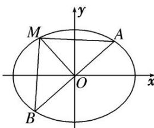

<!-- question-source:start -->
[例 8] 如图，已知 $M(x_{0}, y_{0})$ 是椭圆 C: $\frac{x^{2}}{6} + \frac{y^{2}}{3} = 1$ 上的任一点，从原点 O 向圆 M: $(x - x_{0})^{2} + (y - y_{0})^{2} = 2$ 作两条切线，分别交椭圆于点 P, Q.

(1)若直线 $OP$ ， $OQ$ 的斜率存在，并记为 $k_{1}$ ， $k_{2}$ ，求证： $k_{1}k_{2}$ 为定值；

(2)试问 $|OP|^{2}+|OQ|^{2}$ 是否为定值？若是，求出该值；若不是，说明理由.

[规范解答]
(1)证明：因为直线 $OP: y = k_1x$ ， $OQ: y = k_2x$ 与圆 $M$ 相切，所以 $\frac{|k_1x_0 - y_0|}{\sqrt{1 + k_1^2}} = \sqrt{2}$ ，化简得： $(x_0^2 - 2)k_1^2 - 2x_0y_0k_1 + y_0^2 - 2 = 0$ ，同理： $(x_0^2 - 2)k_2^2 - 2x_0y_0k_2 + y_0^2 - 2 = 0$ ，

所以 $k_{1}$ ， $k_{2}$ 是关于 k 的方程 $(x_{0}^{2}-2)k^{2}-2x_{0}y_{0}k+y_{0}^{2}-2=0$ 的两个不相等的实数根，所以 $k_{1}\cdot k_{2}=\frac{y_{0}^{2}-2}{x_{0}^{2}-2}$ .
因为点 $M(x_{0}, y_{0})$ 在椭圆 C 上，所以 $\frac{x_{0}^{2}}{6} + \frac{y_{0}^{2}}{3} = 1$ ，即 $y_{0}^{2} = 3 - \frac{1}{2} x_{0}^{2}$ ，所以 $k_{1}k_{2}=\frac{1-\frac{1}{2}x_{0}^{2}}{x_{0}^{2}-2}=-\frac{1}{2}$ 为定值.
(2) $|OP|^{2}+|OQ|^{2}$ 是定值，定值为9．理由如下：

①当 M 点坐标为 $(\sqrt{2}, \sqrt{2})$ 时，直线 OP，OQ 落在坐标轴上，显然有 $|OP|^{2} + |OQ|^{2} = 9$ .

①当 $M$ 点坐标为 $(\sqrt{2},\sqrt{2})$ 时，直线 $OP$ ， $OQ$ 落在坐标轴上，显然有 $|OP|^{2} + |OQ|^{2} = 9$ ②当直线 $OP$ ， $OQ$ 不落在坐标轴上时，设 $P(x_{1},y_{1})$ ， $Q(x_{2},y_{2})$ ，因为 $k_{1}k_{2} = -\frac{1}{2}$ ，所以 $y_{1}^{2}y_{2}^{2} = \frac{1}{4} x_{1}^{2}x_{2}^{2}$ 因为 $P(x_{1},y_{1})$ ， $Q(x_{2},y_{2})$ 在椭圆 $C$ 上，所以 $\left\{ \begin{array}{l}x_1^2 + y_1^2 = 1,\\ x_2^2 + y_2^2 = 1, \end{array} \right.$ 即 $\left\{ \begin{array}{l}y_1^2 = 3 - \frac{1}{2} x_1^2,\\ y_2^2 = 3 - \frac{1}{2} x_2^2, \end{array} \right.$ 所以 $\left[3 - \frac{1}{2} x_1^2\right]\left(3 - \frac{1}{2} x_2^2\right) = \frac{1}{4} x_1^2 x_2^2$ ，整理得 $x_{1}^{2} + x_{2}^{2} = 6,$ 所以 $y_{1}^{2} + y_{2}^{2} = \left(3 - \frac{1}{2} x_{1}^{2}\right) + \left(3 - \frac{1}{2} x_{2}^{2}\right) = 3$ ，所以 $|OP|^2 +|OQ|^2 = 9.$ [例9] 已知椭圆 $C:\frac{x^2}{a^2} +\frac{y^2}{b^2} = 1(a > b >0)$ 经过(1，1)与 $\left[\frac{\sqrt{6}}{2},\frac{\sqrt{3}}{2}\right]$ 两点.

(1)求椭圆 C 的方程;

(2)过原点的直线 l 与椭圆 C 交于 A, B 两点, 椭圆 C 上一点 M 满足 $|MA| = |MB|$ . 求证 $\frac{1}{|OA|^{2}} + \frac{1}{|OB|^{2}} + \frac{2}{|OM|^{2}}$ 为定值.

[规范解答]
(1) 将 $(1, 1)$ 与 $\left(\frac{\sqrt{6}}{2}, \frac{\sqrt{3}}{2}\right)$ 两点代入椭圆 C 的方程，得 $\left\{\begin{aligned}\frac{1}{a^{2}}+\frac{1}{b^{2}}=1,\\ \frac{3}{2a^{2}}+\frac{3}{4b^{2}}=1,\end{aligned}\right.$ 解得 $\left\{\begin{aligned}a^{2}=3,\\ b^{2}=\frac{3}{2}.\end{aligned}\right.$ ∴椭圆 C 的方程为 $\frac{x^{2}}{3} + \frac{2y^{2}}{3} = 1$ .

(2)证明：由 $|MA|=|MB|$ ，知M在线段AB的垂直平分线上，由椭圆的对称性知A，B关于原点对称.

①若点 A, B 是椭圆的短轴顶点，则点 M 是椭圆的一个长轴顶点，

此时 $\frac{1}{|OA|^2} +\frac{1}{|OB|^2} +\frac{2}{|OM|^2} = \frac{1}{b^2} +\frac{1}{b^2} +\frac{2}{a^2} = 2.$

同理，若点 $A$ ， $B$ 是椭圆的长轴顶点，则点 $M$ 是椭圆的一个短轴顶点，

此时 $\frac{1}{|OA|^2} +\frac{1}{|OB|^2} +\frac{2}{|OM|^2} = \frac{1}{a^2} +\frac{1}{a^2} +\frac{2}{b^2} = 2.$

②若点 A, B, M 不是椭圆的顶点，设直线 l 的方程为 $y=kx(k\neq0)$ ,

则直线 OM 的方程为 $y = -\frac{1}{k}x$ ，设 $A(x_{1}, y_{1})$ ， $B(-x_{1}, -y_{1})$ ，

由 $\left\{\begin{aligned}y=kx,\\ \frac{x^{2}}{3}+\frac{2y^{2}}{3}=1,\end{aligned}\right.$ 消去 y 得， $x^{2}+2k^{2}x^{2}-3=0$ ，解得 $x_{1}^{2}=\frac{3}{1+2k^{2}}$ ， $y_{1}^{2}=\frac{3k^{2}}{1+2k^{2}}$

$\therefore |OA|^2 = |OB|^2 = x_1^2 + y_1^2 = \frac{3(1 + k^2)}{1 + 2k^2}$ ，同理 $|OM|^2 = \frac{3(1 + k^2)}{2 + k^2}$

$\therefore \frac{1}{|OA|^2} + \frac{1}{|OB|^2} + \frac{2}{|OM|^2} = 2 \times \frac{1 + 2k^2}{3(1 + k^2)} + \frac{2(2 + k^2)}{3(1 + k^2)} = 2.$ 故 $\frac{1}{|OA|^2} + \frac{1}{|OB|^2} + \frac{2}{|OM|^2} = 2$ 为定值.
<!-- question-source:end -->
