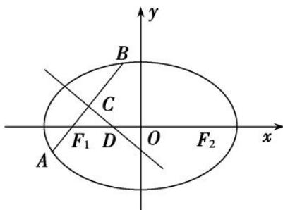

<!-- question-source:start -->
[例 11] 如图，已知椭圆 C: $\frac{x^{2}}{a^{2}}+\frac{y^{2}}{b^{2}}=1(a>b>0)$ 经过点 $(1,\frac{3}{2})$ ，且离心率为 $\frac{1}{2}$ .

(1)求椭圆 C 的方程;

(2)若直线 $l$ 过椭圆 $C$ 的左焦点 $F_{1}$ 交椭圆于 $A, B$ 两点， $AB$ 的中垂线交长轴于点 $D$ 。试探索 $\frac{|DF_1|}{|AB|}$ 是否为定值。若是，求出该定值；若不是，请说明理由。

[规范解答]
(1)椭圆 C 的离心率为 $\frac{1}{2}$ ，则 $\frac{c}{a} = \frac{1}{2}$ ，即 $a^{2} = 4c^{2}$ ， $b^{2} = a^{2} - c^{2} = 3c^{2}$ .

又因为椭圆 C: $\frac{x^{2}}{4c^{2}}+\frac{y^{2}}{3c^{2}}=1$ 经过点 $\left(1,\frac{3}{2}\right)$ ，所以 $\frac{1}{4c^{2}}+\frac{3}{4c^{2}}=1$ ，解得 c=1，

所以椭圆 C 的方程为 $\frac{x^{2}}{4} + \frac{y^{2}}{3} = 1$ .

(2)①证明：当直线 l 与 x 轴重合时，点 D 与点 O 重合，A，B 为长轴顶点，则 $\frac{|DF_{1}|}{|AB|} = \frac{1}{4}$ .

②当直线 l 与 x 轴不重合时，设 $A(x_{1}, y_{1})$ ， $B(x_{2}, y_{2})$ ，直线 AB: x=my-1，

由 $\left\{ \begin{array}{l} x = my - 1, \\ \frac{x^2}{4} + \frac{y^2}{3} = 1, \end{array} \right.$ 得 $(3m^2 + 4)y^2 - 6my - 9 = 0$ ，则 $y_1 + y_2 = \frac{6m}{3m^2 + 4}, y_1y_2 = -\frac{9}{3m^2 + 4}, \Delta = 12^2(m^2 + 1) > 0,$

所以 $|AB|=\frac{\sqrt{m^{2}+1}}{3m^{2}+4}\cdot\sqrt{A}=\frac{12(m^{2}+1)}{3m^{2}+4}.$

设 AB 的中点为 $C(x_{3}, y_{3})$ ，则 $y_{3}=\frac{1}{2}(y_{1}+y_{2})=\frac{1}{2}\times\frac{6m}{3m^{2}+4}=\frac{3m}{3m^{2}+4}$ ,

$$
= \frac {1}{2} \left(x _ {1} + x _ {2}\right) = \frac {1}{2} \left[ m \left(y _ {1} + y _ {2}\right) - 2 \right] = - \frac {4}{3 m ^ {2} + 4},
$$

所以直线 $CD: y - \frac{3m}{3m^2 + 4} = -m\left(x + \frac{4}{3m^2 + 4}\right)$ ，令 $y = 0$ ，得 $x_D = -\frac{1}{3m^2 + 4}$ ，

则 $|DF_{1}|=-\frac{1}{3m^{2}+4}-(-1)=\frac{3(m^{2}+1)}{3m^{2}+4}$ ，所以 $\frac{|DF_{1}|}{|AB|}=\frac{3(m^{2}+1)}{3m^{2}+4}\div\frac{12(m^{2}+1)}{3m^{2}+4}=\frac{1}{4}$ 为定值.
<!-- question-source:end -->
