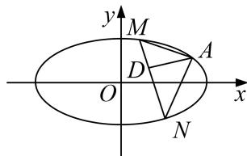

<!-- question-source:start -->
3. 已知椭圆 $C: \frac{x^2}{a^2} + \frac{y^2}{b^2} = 1 (a > b > 0)$ 的离心率为 $\frac{\sqrt{3}}{2}$ , 且过点 $A(2, 1)$ .

(1)求 C 的方程;

(2)点 M, N 在 C 上，且 $AM \perp AN$ , $AD \perp MN$ , D 为垂足，问是否存在定点 Q，使得 $|DQ|$ 为定值，若存在，求出 Q 点，若不存在，请说明理由.

<!-- question-source:end -->

![[高中/总复习/专题/圆锥曲线/专题19  距离型定值型问题-圆锥曲线/专题19__距离型定值型问题/对点训练/answers/Q00042509A1.md]]
