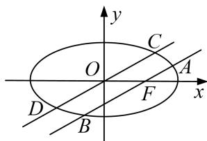

<!-- question-source:start -->
10. 在直角坐标系 $xOy$ 中，动点 $P$ 与定点 $F(1,0)$ 的距离和它到定直线 $x = 4$ 的距离之比是 $1:2$ ，设动点 $P$ 的轨迹为 $E$ .

(1)求动点 P 的轨迹 E 的方程;

(2)设过 $F$ 的直线交轨迹 $E$ 的弦为 $AB$ , 过原点的直线交轨迹 $E$ 的弦为 $CD$ , 若 $CD \parallel AB$ , 求证: $\frac{|CD|^2}{|AB|}$ 为定值.

<!-- question-source:end -->

![[高中/总复习/专题/圆锥曲线/专题19  距离型定值型问题-圆锥曲线/专题19__距离型定值型问题/对点训练/answers/Q00042516A1.md]]
