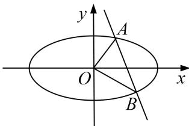

> [!faq]- 《专题19  距离型定值型问题-圆锥曲线》例题解析
>
> > [!success]- **【答案】** 详见解析
>
> > [!note]- **【分析】**
> > 本题未单列分析。
>
> > [!note]- **【解析】**
> > (1)求椭圆的方程;
> >
> > (2)已知直线 $l: y = kx + m$ 与椭圆交于 $A, B$ 两点， $O$ 为坐标原点，且 $OA \perp OB, O$ 到直线 $l$ 的距离是否为定值？若是，求出该定值；若不是，请说明理由.
> >
> > 
> >
> > 2. 解析
> > (1)令焦距为 $2c$ ，依题意可得 $F_{1}(-1,0)$ ，右焦点 $F_{2}(1,0)$ ，
> >
> > $|PF_{1}|+|PF_{2}|=\frac{\sqrt{2}}{2}+\frac{3\sqrt{2}}{2}=2\sqrt{2}=2a$ ，所以 $a=\sqrt{2}$ ，b=1，所以椭圆方程为 $\frac{x^{2}}{2}+y^{2}=1$ ；
> >
> > (2)设 $A(x_{1},y_{1}),B(x_{2},y_{2})$ ，由 $\left\{ \begin{array}{l}y = kx + m,\\ \frac{x^2}{2} +y^2 = 1, \end{array} \right.$ 整理可得 $(2k^{2} + 1)x^{2} + 4kmx + 2m^{2} - 2 = 0,$
> >
> > $$
> > x _ {1} + x _ {2} = \frac {- 4 k m}{1 + 2 k ^ {2}}, x _ {1} x _ {2} = \frac {2 m ^ {2} - 2}{1 + 2 k ^ {2}}.
> > $$
> >
> > $$
> > y _ {1} y _ {2} = \left(k x _ {1} + m\right) \left(k x _ {2} + m\right) = k ^ {2} x _ {1} x _ {2} + k m \left(x _ {1} + x _ {2}\right) + m ^ {2} = k ^ {2} \frac {2 m ^ {2} - 2}{1 + 2 k ^ {2}} + k m \frac {- 4 k m}{1 + 2 k ^ {2}} + m ^ {2} = \frac {m ^ {2} - 2 k ^ {2}}{1 + 2 k ^ {2}},
> > $$
> >
> > 由 $\overrightarrow{OA} \cdot \overrightarrow{OB} = x_1x_2 + y_1y_2 = \frac{2m^2 - 2}{1 + 2k^2} + \frac{m^2 - 2k^2}{1 + 2k^2} = \frac{3m^2 - 2k^2 - 2}{1 + 2k^2} = 0$ ，得 $3m^2 = 2(k^2 + 1)$ ，
> >
> > 所以原点 O 到直线 l 的距离为 $\frac{|m|}{\sqrt{1+k^{2}}}=\frac{|m|}{\sqrt{\frac{3}{2}m^{2}}}=\frac{\sqrt{6}}{3}$ ，为定值.
