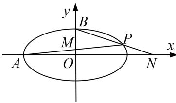

> [!faq]- 《专题19  距离型定值型问题-圆锥曲线》例题解析
>
> > [!success]- **【答案】** 详见解析
>
> > [!note]- **【分析】**
> > 本题未单列分析。
>
> > [!note]- **【解析】**
> > (1)求椭圆 C 的标准方程;
> >
> > (2)设点 P 是椭圆 C 上一点，左顶点为 A，上顶点为 B，直线 PA 与 y 轴交于点 M，直线 PB 与 x 轴交于点 N，求证： $|AN|\cdot|BM|$ 为定值.
> >
> > 
> >
> > 4. 解析
> > (1)依题意得 $\mathrm{e} = \frac{\sqrt{2}}{2}$ ，设 $\mathrm{e} = \sqrt{2} m$ ，则 $a = 2m$ ， $a = \sqrt{2} m$
> >
> > 由点 $G(\sqrt{2}, 1)$ 在椭圆上，有 $\frac{2}{a^2} + \frac{1}{b^2} = 1$ ，解得 $m = 1$ ，则 $a = 2$ ， $b = \sqrt{2}$
> >
> > 椭圆 C 的方程为： $\frac{x^{2}}{4}+\frac{y^{2}}{2}=1$ .
> >
> > (2)设 $P(x_{0}, y_{0})$ ， $M(0, m)$ ， $N(n, 0)$ ， $A(-2, 0)$ ， $B(0, \sqrt{2})$ ，则 $Q(x_{2}, y_{2})$ ，由 A，P，M 三点共线，则有 $k_{PA}=k_{MA}$ ，即 $\frac{y_{0}}{x_{0}+2}=\frac{m}{2}$ ，解得 $m=\frac{2y_{0}}{x_{0}+2}$ ，则 $M(0, \frac{2y_{0}}{x_{0}+2})$ ，
> >
> > 由 $B, P, N$ 三点共线，有 $k_{PB} = k_{NB}$ ，即 $\frac{y_0 - \sqrt{2}}{x_0} = \frac{-\sqrt{2}x_0}{n}$ ，解得 $m = \frac{-\sqrt{2}x_0}{y_0 - \sqrt{2}}$ ，则 $N(0, \frac{-\sqrt{2}x_0}{y_0 - \sqrt{2}})$
> >
> > $$
> > | A N | \cdot | B M | = \left| \frac {- \sqrt {2} x _ {0}}{y _ {0} - \sqrt {2}} + 2 \right| \cdot \left| \frac {2 y _ {0}}{x _ {0} + 2} - \sqrt {2} \right| = \left| \frac {- \sqrt {2} x _ {0} + 2 y _ {0} - 2 \sqrt {2}}{y _ {0} - \sqrt {2}} \right| \cdot \left| \frac {2 y _ {0} - \sqrt {2} x _ {0} - 2 \sqrt {2}}{x _ {0} + 2} \right|
> > $$
> >
> > $$
> > = \left| \frac {4 y _ {0} ^ {2} + 2 x _ {0} ^ {2} - 4 \sqrt {2} x _ {0} y _ {0} - 4 \sqrt {2} (2 y _ {0} - \sqrt {2} x _ {0}) + 8}{x _ {0} y _ {0} - \sqrt {2} x _ {0} + 2 y _ {0} - 2 \sqrt {2}} \right|
> > $$
> >
> > 又点 P 在椭圆上，满足 $\frac{x_{0}^{2}}{4} + \frac{y_{0}^{2}}{2} = 1$ ，有 $2x_{0}^{2} + 4y_{0}^{2} = 8$ ，
> >
> > 代入上式得 $|AN|\cdot|BM|=|\frac{-4\sqrt{2}x_{0}y_{0}-4\sqrt{2}(2y_{0}-\sqrt{2}x_{0})+16}{x_{0}y_{0}-\sqrt{2}x_{0}+2y_{0}-2\sqrt{2}}|=|\frac{4\sqrt{2}x_{0}y_{0}+4\sqrt{2}(2y_{0}-\sqrt{2}x_{0})-16}{x_{0}y_{0}+(2y_{0}-2\sqrt{2}x_{0})-2\sqrt{2}}|=4\sqrt{2}$
> >
> > $$
> > | A N | \cdot | B M |
> > $$
> >
> > $$
> > 4 \sqrt {2}
> > $$
