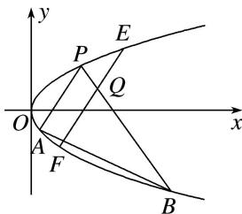

> [!faq]- 《专题19  距离型定值型问题(教师版)》例题解析
>
> > [!success]- **【答案】** 详见解析
>
> > [!note]- **【解析】**
> > (1)求弦 AB 中点 M 的纵坐标;
> >
> > (2)点 $Q$ 是线段 $PB$ 上任意一点(异于端点)，过 $Q$ 作 $PA$ 的平行线交抛物线于 $E, F$ 两点，求证： $|QE| \cdot |QF| - |QP| \cdot |QB|$ 为定值.
> >
> > 
> >
> > 6. 解析
> > (1) $k_{AB}=\frac{y_{A}-y_{B}}{x_{A}-x_{B}}=\frac{1}{y_{A}+y_{B}}=-\frac{1}{2}, (*)$ ，所以 $y_{A}+y_{B}=-2, y_{M}=\frac{y_{A}+y_{B}}{2}=-1$ .
> >
> > (2)设 $Q(x_{0}, y_{0})$ ，直线 EF: $x - x_{0} = t_{1}(y - y_{0})$ ，直线 PB: $x - x_{0} = t_{2}(y - y_{0})$ ,
> >
> > 联立方程组 $\left\{ \begin{array}{l} x - x_0 = t_1(y - y_0), \\ y^2 = x, \end{array} \right.$ 得 $y^{2} - t_{1}y + t_{1}y_{0} - x_{0} = 0$ ，所以 $y_{E} + y_{F} = t_{1}, y_{E} \cdot y_{F} = t_{1}y_{0} - x_{0}$ ，
> >
> > $|QE|\cdot|QF|=\sqrt{1+t_{1}^{2}}|y_{E}-y_{0}|\cdot\sqrt{1+t_{1}^{2}}|y_{F}-y_{0}|=(1+t_{1}^{2})|y_{0}^{2}-x_{0}|$ . 同理 $|QP|\cdot|QB|=(1+t_{2}^{2})|y_{0}^{2}-x_{0}|$ .
> >
> > 由(\*)可知， $t_{1}=\frac{1}{k_{EF}}=\frac{1}{k_{PA}}=y_{A}+y_{P},\quad t_{2}=\frac{1}{k_{PB}}=y_{B}+y_{P},$
> >
> > 所以 $t_{1}+t_{2}=(y_{A}+y_{B})+2y_{P}=-2+2=0$ ，即 $t_{1}=-t_{2}\Rightarrow t_{1}^{2}=t_{2}^{2}$
> >
> > 所以 $|QE|\cdot|QF|=|QP|\cdot|QB|$ ，即 $|QE|\cdot|QF|-|QP|\cdot|QB|=0$ 为定值.
