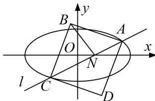

<!-- question-source:start -->
[例 1] 已知椭圆 C: $\frac{x^{2}}{a^{2}}+\frac{y^{2}}{b^{2}}=1(a>b>0)$ 过点 $(0,1)$ ，且离心率为 $\frac{\sqrt{3}}{2}$ .

(1)求椭圆 E 的标准方程;

(2)设直线 $l: y = \frac{1}{2} x + m$ 与椭圆 $E$ 交于 $A, C$ 两点，以 $AC$ 为对角线作正方形ABCD，记直线 $l$ 与 $x$ 轴的交点为 $N$ ，求证： $|BN|$ 为定值.

(2)设 $A(x_{1}, y_{1})$ ， $C(x_{2}, y_{2})$ ，线段 AC 的中点为 M，

联立 $\left\{ \begin{array}{l} y = \frac{1}{2} x + m, \\ \frac{x^2}{4} + y^2 = 1, \end{array} \right.$ ，消去 $y$ ，得 $x^2 + 2mx + 2m^2 - 2 = 0$

由 $\Delta=(2m^{2})^{2}-4(2m^{2}-2)>0$ 。解得 $-\sqrt{2}<m<\sqrt{2}$ ， $x_{1}+x_{2}=-2m$ ， $x_{1}x_{2}=2m^{2}-2$ ，

$$
y _ {1} + y _ {2} = \frac {1}{2} \left(x _ {1} + x _ {2}\right) + 2 m = m, \quad \therefore M (- m, \frac {m}{2}).
$$

$$
\therefore | A C | = \sqrt {1 + k ^ {2}} \cdot \sqrt {(x _ {1} + x _ {2}) ^ {2} - 4 x _ {1} x _ {2}} = \sqrt {1 0 - 5 m ^ {2}}.
$$

又直线 l 与 x 轴的交点 $N(-2m, 0)$ ，∴ $|MN| = \sqrt{\frac{5}{4} m^{2}}$

$\therefore |BN|^2 = |BM|^2 + |MN|^2 = \frac{1}{4} |AC|^2 + |MN|^2 = \frac{5}{2}$ ，故 $|BN|$ 为定值.
<!-- question-source:end -->

![[高中/总复习/专题/圆锥曲线/专题19  距离型定值型问题-圆锥曲线/专题19_距离型定值型问题/例题选讲/例题/answers/Q00032518A1.md]]
