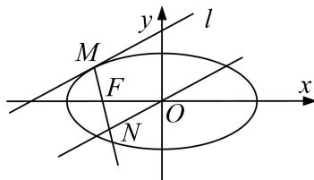

<!-- question-source:start -->
[例2] 已知椭圆 $C: \frac{x^2}{a^2} + \frac{y^2}{b^2} = 1 (a > b > 0)$ 在右、上顶点分别为 $A, B, F$ 是椭圆 $C$ 的左焦点， $P(\frac{\sqrt{2}}{2}, \frac{\sqrt{3}}{2})$ 是椭圆 $C$ 上的点，且 $|OB| = |OF|$ ( $O$ 是坐标原点).

(1)求椭圆 C 的方程;

(2)设直线 $l$ 与椭圆 $C$ 相切于点 $M(M$ 在第二象限)，过 $O$ 作直线 $l$ 的平行线与直线 $MF$ 相交于点 $N$ ，问：线段 $MN$ 的长是否为定值？若是，求出该定值；若不是，说明理由.

(2)由题 $F(-1, 0)$ ，设切点 $M(x_0, y_0)$ ，则 $\frac{x_0^2}{2} + y_0^2 = 1$ ，切线 $l: \frac{x_0x}{2} + y_0y = 1$

而 $ON // l$ ，且 $ON$ 过原点，所以 $ON: \frac{x_0x}{2} + y_0y = 0$

而直线 $MF: (x_0 + 1)y = y_0(x + 1)$ ，联立 $ON$ 与 $MF$ 的方程可解得 $N\left(\frac{-2y_0^2}{2 + x_0}, \frac{x_0y_0}{2 + x_0}\right)$ ，

$$
\left| M N \right| ^ {2} = \left(x _ {0} + \frac {2 y _ {0} {} ^ {2}}{2 + x _ {0}}\right) ^ {2} + \left(y _ {0} - \frac {x _ {0} y _ {0}}{2 + x _ {0}}\right) = \left(\frac {2 + 2 x _ {0}}{2 + x _ {0}}\right) ^ {2} + \left(\frac {2 y _ {0}}{2 + x _ {0}}\right) ^ {2} = 2,
$$

所以 $|MN|=\sqrt{2}$ ，为定值.
<!-- question-source:end -->

![[高中/总复习/专题/圆锥曲线/专题19  距离型定值型问题-圆锥曲线/专题19_距离型定值型问题/例题选讲/例题/answers/Q00032519A1.md]]
