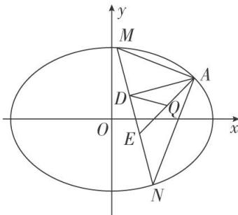
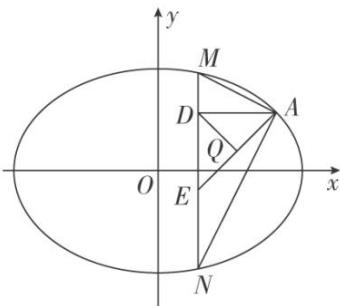

<!-- question-source:start -->
[例4] (2020·新高考I)已知椭圆 $C: \frac{x^2}{a^2} + \frac{y^2}{b^2} = 1 (a > b > 0)$ 的离心率为 $\frac{\sqrt{2}}{2}$ ，且过点 $A(2, 1)$ .

(1)求 $C$ 的方程；

(2)点 $M, N$ 在 $C$ 上，且 $AM \perp AN, AD \perp MN, D$ 为垂足．证明：存在定点 $Q$ ，使得 $|DQ|$ 为定值.

(2)设点 $M(x_{1}, y_{1})$ ， $N(x_{2}, y_{2})$ 。因为 $AM \perp AN$ ，所以 $\overrightarrow{AM} \cdot \overrightarrow{AN} = 0$ ，

即 $(x_{1} - 2)(x_{2} - 2) + (y_{1} - 1)(y_{2} - 1) = 0.$ ①

当直线 MN 的斜率存在时，设其方程为 $y=kx+m$ ，如图 1.

图1

代入椭圆方程消去 y 并整理，得 $(1+2k^{2})x^{2}+4kmx+2m^{2}-6=0$ ，

$x_{1} + x_{2} = -\frac{4km}{1 + 2k^{2}}, x_{1}x_{2} = \frac{2m^{2} - 6}{1 + 2k^{2}},$ ②

根据 $y_{1}=kx_{1}+m,\quad y_{2}=kx_{2}+m$ ，代入①整理，可得

$$
(k ^ {2} + 1) x _ {1} x _ {2} + (k m - k - 2) \left(x _ {1} + x _ {2}\right) + (m - 1) ^ {2} + 4 = 0,
$$

将②代入上式，得 $(k^2 + 1)\frac{2m^2 - 6}{1 + 2k^2} + (km - k - 2) \cdot \left(-\frac{4km}{1 + 2k^2}\right) + (m - 1)^2 + 4 = 0$

整理化简得 $(2k+3m+1)(2k+m-1)=0$ ,

因为 $A(2,1)$ 不在直线 MN 上，所以 $2k+m-1\neq0$ ，所以 $2k+3m+1=0$ ， $k\neq1$ ，

于是直线 MN 的方程为 $y=k\left(x-\frac{2}{3}\right)-\frac{1}{3}$ ，所以直线 MN 过定点 $E\left(\frac{2}{3}, -\frac{1}{3}\right)$ .

当直线 MN 的斜率不存在时，可得 $N(x_{1}, -y_{1})$ ，如图 2.

图2

代入 $(x_{1}-2)(x_{2}-2)+(y_{1}-1)(y_{2}-1)=0$ ，得 $(x_{1}-2)^{2}+1-y_{1}^{2}=0$ ，

结合 $\frac{x_{1}^{2}}{6}+\frac{y_{1}^{2}}{3}=1$ ，解得 $x_{1}=2$ （舍去）或 $x_{1}=\frac{2}{3}$ ，此时直线MN过点 $E\left(\frac{2}{3},-\frac{1}{3}\right)$ .

因为 $|AE|$ 为定值，且 $\triangle ADE$ 为直角三角形，AE为斜边，

所以 AE 的中点 Q 满足 $|DQ|$ 为定值 $\left(AE\right.$ 长度的一半 $\frac{1}{2}\sqrt{\left(2-\frac{2}{3}\right)^{2}+\left(1+\frac{1}{3}\right)^{2}}=\frac{2\sqrt{2}}{3}\right)$ .

由于 $A(2,1)$ ， $E\left(\frac{2}{3},-\frac{1}{3}\right)$ ，故由中点坐标公式可得 $Q\left(\frac{4}{3},\frac{1}{3}\right)$ .

故存在点 $Q\left(\frac{4}{3}, \frac{1}{3}\right)$ ，使得 $|DQ|$ 为定值.
<!-- question-source:end -->

![[高中/总复习/专题/圆锥曲线/专题19  距离型定值型问题-圆锥曲线/专题19_距离型定值型问题/例题选讲/例题/answers/Q00032521A1.md]]
