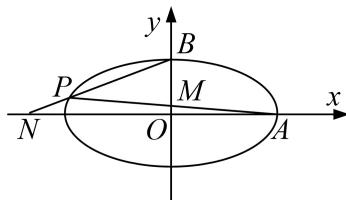

<!-- question-source:start -->
[例 5] (2016·北京)已知椭圆 C: $\frac{x^{2}}{a^{2}}+\frac{y^{2}}{b^{2}}=1(a>b>0)$ 的离心率为 $\frac{\sqrt{3}}{2}$ ， $A(a,0)$ ， $B(0,b)$ ， $O(0,0)$ ， $\triangle OAB$ 的面积为 1.

(1)求椭圆 C 的方程;

(2)设 $P$ 是椭圆 $C$ 上一点，直线 $PA$ 与 $y$ 轴交于点 $M$ ，直线 $PB$ 与 $x$ 轴交于点 $N$ ．求证： $\vert AN\vert \cdot \vert BM\vert$ 为定值.

(2)证明：由(1)知， $A(2,0)$ ， $B(0,1)$ 。设 $P(x_{0},y_{0})$ ，则 $x_{0}^{2}+4y_{0}^{2}=4$ 。

当 $x_{0} \neq 0$ 时，直线 PA 的方程为 $y = \frac{y_{0}}{x_{0} - 2}(x - 2)$ .

令 $x = 0$ ，得 $y_{M} = -\frac{2y_{0}}{x_{0} - 2}$ ，从而 $|BM| = |1 - y_M| = \left|1 + \frac{2y_0}{x_0 - 2}\right|$

直线 $PB$ 的方程为 $y = \frac{y_0 - 1}{x_0} x + 1$ 。令 $y = 0$ ，得 $x_N = -\frac{x_0}{y_0 - 1}$ ，从而 $|AN| = |2 - x_N| = \left|2 + \frac{x_0}{y_0 - 1}\right|$ 。

所以 $|AN|\cdot |BM| = \left|2 + \frac{x_0}{y_0 - 1}\right|$ · $\left|1 + \frac{2y_0}{x_0 - 2}\right| = \left|\frac{x_0^2 + 4y_0^2 + 4x_0y_0 - 4x_0 - 8y_0 + 4}{x_0y_0 - x_0 - 2y_0 + 2}\right| =$ $\left|\frac{4x_0y_0 - 4x_0 - 8y_0 + 8}{x_0y_0 - x_0 - 2y_0 + 2}\right| = 4.$

当 $x_{0}=0$ 时， $y_{0}=-1$ ， $|BM|=2$ ， $|AN|=2$ ，所以 $|AN|\cdot|BM|=4$ 。综上， $|AN|\cdot|BM|$ 为定值。
<!-- question-source:end -->

![[高中/总复习/专题/圆锥曲线/专题19  距离型定值型问题-圆锥曲线/专题19_距离型定值型问题/例题选讲/例题/answers/Q00032522A1.md]]
