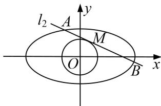

<!-- question-source:start -->
[例 6] 已知椭圆 C: $\frac{x^{2}}{6}+\frac{y^{2}}{3}=1$ .

(1)直线 l 过点 $D(1, 1)$ 与椭圆 C 交于 P，Q 两点，若 $\overrightarrow{P}\overrightarrow{D} = \overrightarrow{D}\overrightarrow{Q}$ ，求直线 $l_{1}$ 的方程；

(2)在圆 $O: x^{2} + y^{2} = 2$ 上取一点 $M$ ，过点 $M$ 作圆 $O$ 的切线 $l'$ 与椭圆 $C$ 交于 $A$ ， $B$ 两点，求 $|MA| \cdot |MB|$ 的值.

(2)当切线 $l_{2}$ 斜率不存在时，不妨设 $l'$ 的方程为 $x=\sqrt{2}$ ,

由椭圆 C 的方程可知， $A(\sqrt{2}, \sqrt{2})$ ， $B(\sqrt{2}, -\sqrt{2})$ ，

则 $\overrightarrow{OA} = (\sqrt{2},\sqrt{2}),\overrightarrow{OB} = (\sqrt{2}, - \sqrt{2}),\therefore \overrightarrow{OA}\overrightarrow{OB} = 0$ ，即 $OA\bot OB$

当切线 $l'$ 斜率存在时，可设 $l'$ 的方程为 $y=kx+m$ ， $A(x_{3}, y_{3})$ ， $B(x_{4}, y_{4})$ ，

$\therefore \frac{|m|}{\sqrt{1 + k^2}} = \sqrt{2}$ 即 $m^2 = 2(k^2 + 1)$

联立 $l'$ 和椭圆的方程，得 $(2k^{2}+1)x^{2}+4mkx+2m^{2}-6=0$ ，则 $\Delta=(4mk)^{2}-4(2k^{2}+1)(2m^{2}-6)>0$ ，

$$
x _ {1} + x _ {2} = - \frac {4 k m}{1 + 2 k ^ {2}}, x _ {1} x _ {2} = \frac {2 m ^ {2} - 6}{1 + 2 k ^ {2}}, \because \overrightarrow {O A} = (x _ {3}, y _ {3}), \overrightarrow {O B} = (x _ {4}, y _ {4}),
$$

$$
\therefore \overrightarrow {O A} \cdot \overrightarrow {O B} = x _ {3} x _ {4} + y _ {3} y _ {4} = x _ {3} x _ {4} + (k x _ {3} + m) (k x _ {4} + m) = (k ^ {2} + 1) x _ {3} x _ {4} + m k (x _ {3} + x _ {4}) + m ^ {2}
$$

$$
\begin{array}{l} = (k ^ {2} + 1) \frac {2 m ^ {2} - 6}{1 + 2 k ^ {2}} + m k (- \frac {4 k m}{1 + 2 k ^ {2}}) + m ^ {2} = \frac {(k ^ {2} + 1) (2 m ^ {2} - 6) - 4 m ^ {2} k ^ {2} + m ^ {2} (2 k ^ {2} + 1)}{1 + 2 k ^ {2}} \\ = \frac {3 m ^ {2} - 6 k ^ {2} - 6}{1 + 2 k ^ {2}} = \frac {3 (2 k ^ {2} + 2) - 6 k ^ {2} - 6}{1 + 2 k ^ {2}} = 0, O A \perp O B. \end{array}
$$

综上所述，圆 O 上任意一点 M 处的切线交椭圆 C 于点 A, B，都有 $OA \perp OB$ .

在 Rt△OAB 中，由△OAM 与△BOM 相似，得 $|MA|\cdot|MB|=|OM|^{2}=2$ .
<!-- question-source:end -->

![[高中/总复习/专题/圆锥曲线/专题19  距离型定值型问题-圆锥曲线/专题19_距离型定值型问题/例题选讲/例题/answers/Q00032523A1.md]]
