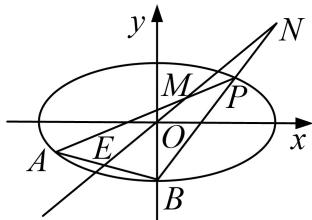

<!-- question-source:start -->
[例7] 如图，已知椭圆 $C: \frac{x^2}{12} + \frac{y^2}{4} = 1$ ，点 $B$ 是其下顶点，过点 $B$ 的直线交椭圆 $C$ 于另一点 $A(A$ 点在 $x$ 轴下方)，且线段 $AB$ 的中点 $E$ 在直线 $y = x$ 上.

(1)求直线 AB 的方程;

(2)若点 $P$ 为椭圆 $C$ 上异于 $A, B$ 的动点，且直线 $AP, BP$ 分别交直线 $y = x$ 于点 $M, N$ ，证明： $|OM| \cdot |ON|$ 为定值.

(2)设 $P(x_{0}, y_{0})$ ，则 $\frac{x_{0}^{2}}{12} + \frac{y_{0}^{2}}{4} = 1$ ，即 $y_{0}^{2} = 4 - \frac{x_{0}^{2}}{3}$ .

设 $M(x_{M}, y_{M})$ ，由 A, P, M 三点共线，即，∴ $\overrightarrow{AP} // \overrightarrow{AM}$ ，∴ $(x_{0}+3)(y_{M}+1)=(y_{0}+1)(x_{M}+3)$ ,

又点 M 在直线 y=x 上，解得 M 点的横坐标 $x_{M}=\frac{3y_{0}-x_{0}}{x_{0}-y_{0}+2}$ ,

设 $N(x_{N}, y_{N})$ ，由 B, P, N 三点共线，即 $\overrightarrow{BP} // \overrightarrow{BN}$ ，∴ $x_{0}(y_{N}+2)=(y_{0}+2)x_{N}$ ,

点 N 在直线 y=x 上，解得 N 点的横坐标 $x_{N}=\frac{-2x_{0}}{x_{0}-y_{0}-2}$ .

$$
O M \cdot O N = \sqrt {2} | x _ {M} - 0 | \cdot \sqrt {2} | x _ {N} - 0 | = 2 | x _ {M} | | x _ {N} | = 2 | \frac {3 y _ {0} - x _ {0}}{x _ {0} - y _ {0} + 2} | \cdot | \frac {- 2 x _ {0}}{x _ {0} - y _ {0} - 2} |
$$

$$
= 2 \left| \frac {2 x _ {0} ^ {2} - 6 x _ {0} y _ {0}}{\left(x _ {0} - y _ {0}\right) ^ {2} - 4} \right| = 2 \left| \frac {2 x _ {0} ^ {2} - 6 x _ {0} y _ {0}}{x _ {0} ^ {2} - 2 x _ {0} y _ {0} - \frac {x _ {0} ^ {2}}{3}} \right| = 2 \left| \frac {x _ {0} ^ {2} - 3 x _ {0} y _ {0}}{\frac {x _ {0} ^ {2}}{3} - x _ {0} y _ {0}} \right| = 6.
$$
<!-- question-source:end -->

![[高中/总复习/专题/圆锥曲线/专题19  距离型定值型问题-圆锥曲线/专题19_距离型定值型问题/例题选讲/例题/answers/Q00032524A1.md]]
