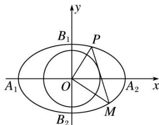

<!-- question-source:start -->
[例10] 如图，已知椭圆 $C_1: \frac{x^2}{4} + y^2 = 1$ 的左、右顶点分别为 $A_1, A_2$ ，上、下顶点分别为 $B_1, B_2$ ，记四边形 $A_1B_1A_2B_2$ 的内切圆为圆 $C_2$ .

(1)求圆 $C_{2}$ 的标准方程;

(2)已知圆 $C_2$ 的一条不与坐标轴平行的切线 $l$ 交椭圆 $C_1$ 于 $P, M$ 两点.

(i)求证： $OP \perp OM;$

(ii)试探究 $\frac{1}{|OP|^2} +\frac{1}{|OM|^2}$ 是否为定值.

(2)(i)证明 可设切线 $l: y = kx + b (k \neq 0)$ , $P(x_1, y_1)$ , $M(x_2, y_2)$ ,

将直线 l 的方程代入椭圆 $C_{1}$ 可得 $\left(\frac{1}{4}+k^{2}\right)x^{2}+2kbx+b^{2}-1=0$ ，由根与系数的关系得，

$\left\{ \begin{array}{l} x_{1} + x_{2} = -\frac{2kb}{\frac{1}{4} + k^{2}}, \\ x_{1}x_{2} = \frac{b^{2} - 1}{\frac{1}{4} + k^{2}}, \end{array} \right.$ 则 $y_{1}y_{2} = (kx_{1} + b)(kx_{2} + b) = k^{2}x_{1}x_{2} + kb(x_{1} + x_{2}) + b^{2} = \frac{-k^{2} + \frac{1}{4}b^{2}}{\frac{1}{4} + k^{2}},$

又 $l$ 与圆 $C_2$ 相切，可知原点 $O$ 到 $l$ 的距离 $d = \frac{|b|}{\sqrt{k^2 + 1^2}} = \frac{2}{\sqrt{5}}$ ，整理得 $k^2 = \frac{5}{4} b^2 - 1$

则 $y_{1}y_{2} = \frac{1 - b^{2}}{\frac{1}{4} + k^{2}}$ ，所以 $\overrightarrow{OP} \cdot \overrightarrow{OM} = x_{1}x_{2} + y_{1}y_{2} = 0$ ，故 $OP \perp OM$ .

(ii)由(i)知 $OP \perp OM,$

①当直线 OP 的斜率不存在时，显然 $|OP|=1$ ， $|OM|=2$ ，此时 $\frac{1}{|OP|^{2}}+\frac{1}{|OM|^{2}}=\frac{5}{4}$ ;

②当直线 OP 的斜率存在时，设直线 OP 的方程为 $y=k_{1}x$ ，

代入椭圆方程可得 $\frac{x^2}{4} + k_1^2 x^2 = 1$ ，则 $x^2 = \frac{4}{1 + 4k_1^2}$ ，

故 $|OP|^{2}=x^{2}+y^{2}=(1+k_{1}^{2})x^{2}=\frac{4(1+k_{1}^{2})}{1+4k_{1}^{2}}$ ，同理 $|OM|^{2}=\frac{4\left[1+\left(-\frac{1}{k_{1}}\right)^{2}\right]}{1+4\left(-\frac{1}{k_{1}}\right)^{2}}=\frac{4(k_{1}^{2}+1)}{k_{1}^{2}+4}$ ，
则 $\frac{1}{|OP|^{2}}+\frac{1}{|OM|^{2}}=\frac{1+4k_{1}^{2}}{4(1+k_{1}^{2})}+\frac{k_{1}^{2}+4}{4(1+k_{1}^{2})}=\frac{5}{4}$ . 综上可知， $\frac{1}{|OP|^{2}}+\frac{1}{|OM|^{2}}=\frac{5}{4}$ 为定值.
<!-- question-source:end -->

![[高中/总复习/专题/圆锥曲线/专题19  距离型定值型问题-圆锥曲线/专题19_距离型定值型问题/例题选讲/例题/answers/Q00032526A1.md]]
